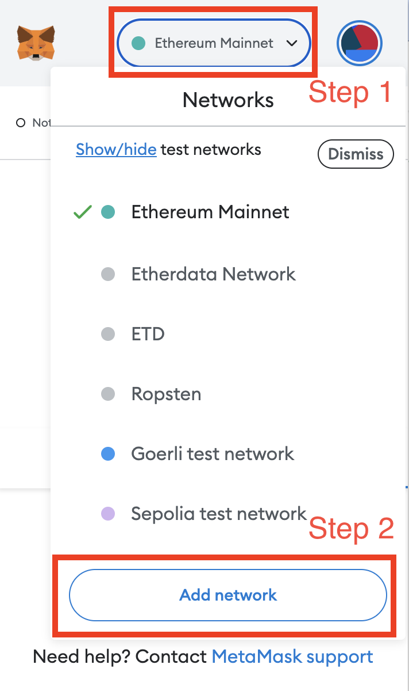
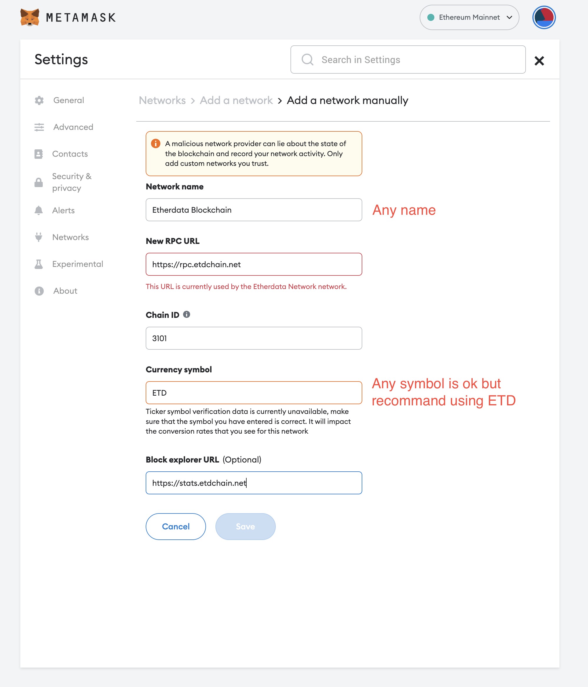
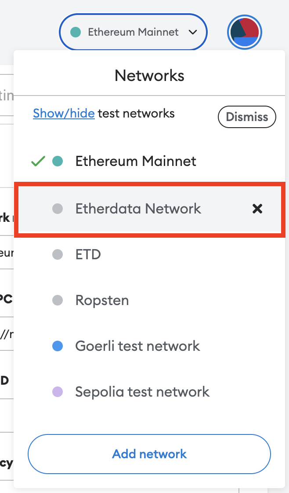
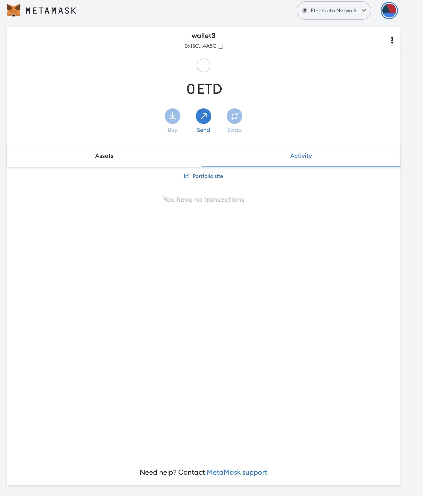

In this class, we provide two endpoints for you to deploy your smart contracts to the
etherdata blockchain network.

## Network details

| --                  | --           | --                         |
| :------------------ | :----------- | :------------------------- |
| **Network Name**    | **Chain ID** | **RPC URL**                |
| Production endpoint | 3101         | https://rpc.etdchain.net   |
| Test endpoint       | 8348         | https://rpc.debugchain.net |

## Connect to the endpoint using metamask

### Open metamask

follow the diagram below to open metamask and add a custom RPC.


### Add a custom RPC



```
Network Name: Etherdata Network
New RPC URL: https://rpc.etdchain.net
Chain ID: 3101
Symbol: ETD
Block Explorer URL: https://stats.etdchain.net
```

### Connect to the network

Open your metamask again, and you will see the network you just added.





## Connect to the endpoint using ethers.js

Using the following codesandbox example to connect to the etherdata network.

<iframe
  src="https://codesandbox.io/embed/web3-connect-0ngc1e?expanddevtools=1&fontsize=14&hidenavigation=1&theme=dark&view=editor"
  style={{
    width: "100%",
    height: "500px",
    border: "0",
    borderRadius: "4px",
    overflow: "hidden",
  }}
  title="Web3 connect"
  allow="accelerometer; ambient-light-sensor; camera; encrypted-media; geolocation; gyroscope; hid; microphone; midi; payment; usb; vr; xr-spatial-tracking"
  sandbox="allow-forms allow-modals allow-popups allow-presentation allow-same-origin allow-scripts"
></iframe>

**Question: How to get the user's balance using ethers.js?**
