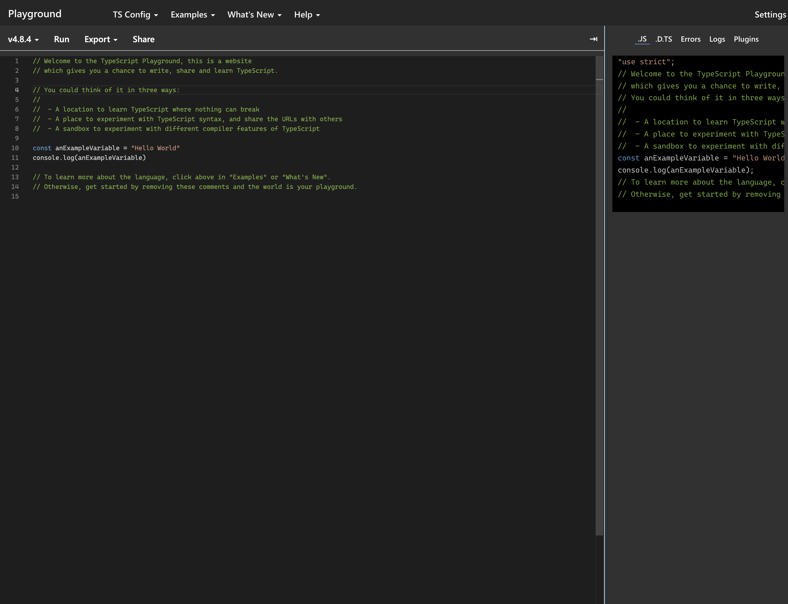

In this tutorial, we will learn some basic typescript concepts and how to use them in our code.

## Typescript basics

### Basic typing

Typescript is a typed language, which means that we need to specify the type of the variables we are using. 
This is not required in javascript, but it is a good practice to use it. Here are some basic types:

- `string` - a string of characters
- `number` - a number
- `boolean` - a boolean value
- `any` - any type of value
- `void` - no type

Let's see some examples:

```typescript
let myString: string = 'Hello world';
let myNumber: number = 42;
let myBoolean: boolean = true;
let myAny: any = 'Hello world';
let myVoid: void = undefined;
```

### Arrays

We can also specify the type of the elements in an array:

```typescript
let myArray: number[] = [1, 2, 3];
```

We can also define a mixed-type array:

```typescript
let myArray: any[] = [1, 'Hello world', true];
```

### Functions

We can also specify the type of the parameters and the return value of a function:

```typescript
function myFunction(param1: string, param2: number): string {
  return param1 + param2;
}
```


### Interfaces

Interfaces are used to define the structure of an object. Let's see an example:

```typescript
interface Person {
  name: string;
  age: number;
}

let myPerson: Person = {
  name: 'John',
  age: 42
};

console.log(myPerson.name); // John
console.log(myPerson.age); // 42
```

### Classes

Classes are used to define the structure of an object. Let's see an example:

```typescript
class Person {
  name: string;
  age: number;

  constructor(name: string, age: number) {
    this.name = name;
    this.age = age;
  }

  greet() {
    console.log(`Hello, my name is ${this.name} and I am ${this.age} years old.`);
  }
}

let myPerson = new Person('John', 42);
myPerson.greet(); // Hello, my name is John and I am 42 years old.
```

### Control flow

Typescript supports the same control flow statements as javascript:

- `if`
- `else`
- `for`
- `while`
- `switch`
- `try/catch`

Let's see an example:

```typescript
let myNumber: number = 42;

// if statement
if (myNumber === 42) {
  console.log('The answer to the ultimate question of life, the universe and everything.');
} else {
  console.log('The number is not 42.');
}

// for loop
for (let i = 0; i < 10; i++) {
  console.log(i);
}

// while loop
let i = 0;
while (i < 10) {
  console.log(i);
  i++;
}

// switch statement
switch (myNumber) {
  case 42:
    console.log('The answer to the ultimate question of life, the universe and everything.');
    break;
  default:
    console.log('The number is not 42.');
}

// try/catch
try {
  throw new Error('An error occurred.');
} catch (e) {
  console.log(e.message);
}
```

### Modules

Typescript supports modules, which are used to split our code into multiple files. Let's see an example:

```typescript
// person.ts
export class Person {
  name: string;
  age: number;

  constructor(name: string, age: number) {
    this.name = name;
    this.age = age;
  }

  greet() {
    console.log(`Hello, my name is ${this.name} and I am ${this.age} years old.`);
  }
}
```

```typescript
// main.ts
import { Person } from './person';

let myPerson = new Person('John', 42);

myPerson.greet(); // Hello, my name is John and I am 42 years old.
```
You can check more typescript examples in [typescript official documentation](https://www.typescriptlang.org/).



## TS-Node

TS-Node is a typescript interpreter that allows us to run typescript code without compiling it. Let's see an example:

> Before running the code, we need to install ts-node globally:

```bash
npm install -g ts-node
```

Create a file named `main.ts` and add the following code:
```typescript
//main.ts
console.log('Hello world');
```

```bash
$ ts-node main.ts
Hello world
```