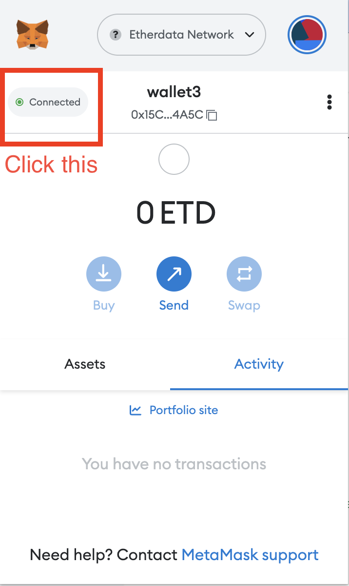
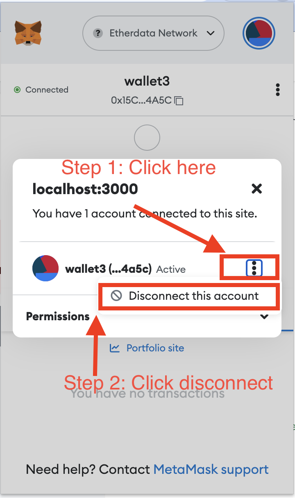

Following examples are written in React. If you are not familar with React,
you can still follow along by reading the code and understanding the concepts.
We will talk React in details in the future.

## Communicate with MetaMask using ethers.js

### Import ethers

Put the following code in `index.ts`:

```typescript
import { ethers } from "ethers";
```

### Connect to MetaMask

:::tip
`window.ethereum` is a global variable injected by MetaMask. It is the
interface to the Ethereum network. You can read more about it
[here](https://docs.metamask.io/guide/ethereum-provider.html#properties).
:::

```typescript
const provider = new ethers.providers.Web3Provider(window.ethereum);
```

### Get the signer

:::tip
A signer is an object that can sign transactions and messages. It is
responsible for sending transactions to the network. You can read more about
it [here](https://docs.ethers.io/v5/api/signer/#Signer).
:::

```typescript
// MetaMask requires requesting permission to connect users accounts
await provider.send("eth_requestAccounts", []);

// The MetaMask plugin also allows signing transactions to
// send ether and pay to change state within the blockchain.
// For this, you need the account signer...
const signer = provider.getSigner();
```

Some properties of the signer:

```typescript
// The signer address
const signerAddress = await signer.getAddress();

// The signer balance
const signerBalance = await signer.getBalance();
```

## React states

React states are used to store data that can be changed over time.
Using state, we can bind the data to the UI and update the UI when the data changes.
We will use them to store the signer address and balance.

### Import useState

```typescript
import { useState } from "react";
```

### Create states

```typescript
const [signerAddress, setSignerAddress] = useState("");
const [signerBalance, setSignerBalance] = useState("");
```

### Update states

```typescript
setSignerAddress(await signer.getAddress());
setSignerBalance(await signer.getBalance());
```

## React callback

React callback is used to call a function when a button is clicked.
We will use it to call the `getSigner` function.

### Import useCallback

```typescript
import { useCallback } from "react";
```

### Create callback

```typescript
const onClick = useCallback(async () => {
  await provider.send("eth_requestAccounts", []);
  await provider.getSigner();
}, []);
```

## React Component

React component is used to create a reusable UI element.
We will use it to create a button to connect to MetaMask.
The syntax is similar to HTML tags.

### Create a component

Create a Component named `WalletApp` and it will display a button to connect to MetaMask.
It will also display the signer address and balance. But currently it has no data to display and button is also not working.

```jsx live
function WalletApp(props) {
  return (
    <div>
      <div>
        <p>Signer Address: </p>
        <p>Signer Balance: </p>
      </div>
      <button>Connect to MetaMask</button>
    </div>
  );
}
```

### Add Callback function to the `WalletApp`

We will bind the `onClick` callback to the button so that it will be called when the button is clicked.
And now you will see the metamask popup when you click the button.

:::warning
If you have issue with the button not working, make sure you disconnect the metamask before clicking the button.




:::

```jsx live
function WalletApp(props) {
  const onClick = useCallback(async () => {
    const provider = new ethers.providers.Web3Provider(window.ethereum);
    await provider.send("eth_requestAccounts", []);
    const signer = await provider.getSigner();
  }, []);

  return (
    <div>
      <div>
        <p>Signer Address: </p>
        <p>Signer Balance: </p>
      </div>
      <button onClick={onClick}>Connect to MetaMask</button>
    </div>
  );
}
```

### Add states to the `WalletApp`

We will bind the states to the UI so that it will be updated when the states are changed.

- `{signerAddress}` will be replaced by the value of `signerAddress` state. And it will be updated when the `signerAddress` state is changed.
- `{signerBalance}` will be replaced by the value of `signerBalance` state. And it will be updated when the `signerBalance` state is changed.

React states are updated using `setState` function. We will update the states in the `onClick` callback.

```jsx live
function WalletApp(props) {
  // create states
  const [signerAddress, setSignerAddress] = useState("");
  const [signerBalance, setSignerBalance] = useState("");

  const onClick = useCallback(async () => {
    const provider = new ethers.providers.Web3Provider(window.ethereum);
    await provider.send("eth_requestAccounts", []);
    const signer = await provider.getSigner();
    // set states
    setSignerAddress(await signer.getAddress());

    const balance = await signer.getBalance();
    const humanReadableBalance = ethers.utils.formatEther(balance);
    setSignerBalance(humanReadableBalance);
  }, []);

  return (
    <div>
      <div>
        <p>Signer Address: {signerAddress}</p>
        <p>Signer Balance: {signerBalance}</p>
      </div>
      <button onClick={onClick}>Connect to MetaMask</button>
    </div>
  );
}
```

And now you have a complete wallet app that can connect to MetaMask and display the signer address and balance.

:::tip
Can you add a progress bar to show the loading state when the button is clicked?
:::
