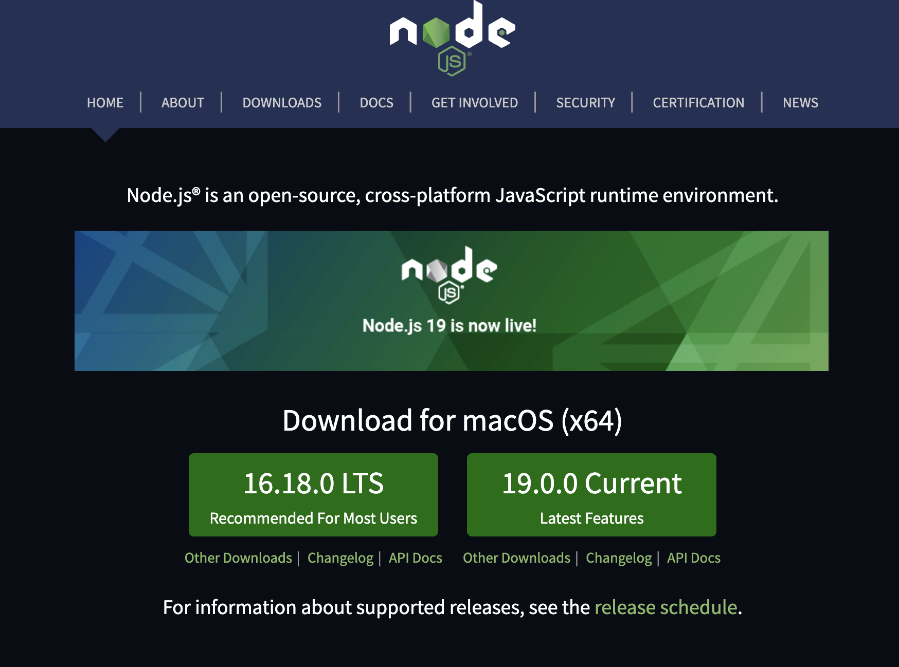

import Tabs from "@theme/Tabs";
import TabItem from "@theme/TabItem";
import InstallNodeTerminal from "../../src/components/part1/InstallNodeTerminal";
import PnpmInitTerminal from "../../src/components/part1/PnpmInitTerminal";
import NpmInitTerminal from "../../src/components/part1/NpmInitTerminal";
import YarnInitTerminal from "../../src/components/part1/YarnInitTerminal";

In order to start your web3 journey, you need to create your wallet first either using [MetaMask](https://metamask.io/) or using [ethers.js](https://docs.ethers.io/v5/). We will talk about creating wallet using MetaMask first and then we will talk about creating wallet using ethers.js.

## Creating wallet using MetaMask

### Download MetaMask from [here](https://metamask.io/)

:::tip
MetaMask is a Chrome extension so you need to have Chrome installed on your computer.
:::


### Follow the installation instructions and create your wallet using mnemonic words.

:::warning
Keep in mind that you need to save your mnemonic words somewhere safe. If you lose your mnemonic words, you will lose your wallet and all the funds in it.
:::

### Check your MetaMask wallet

After you create your wallet, you should see something like this:


- part1: This is your network menu. You can change it to any network you want.
- part2: This is your Wallet address and you can copy it by clicking on the copy icon.
- part3: This is your balance in Ether.

## Creating wallet using ethers.js

### Install [node.js](https://nodejs.org/en/)

:::note
You can download any version of the node.js, however, we recommand you use the LTS version.
:::



### Install node.js and check the installation

Follow the installation instructions and check the installation by running the following command in your terminal:

```bash
node -v
```


:::tip
Extra: By default, node.js comes with npm, a node package manager, for installing node packages. However, you can install other advanced package managers like [yarn](https://yarnpkg.com/) or [pnpm](https://pnpm.io/). We will list commands in three different package managers: npm, yarn, and pnpm. You can choose any package manager you want.
:::


> Yarn package manager


> pnpm package manager

### Create a node package

<InstallNodeTerminal />

Create a test folder

```bash
mkdir test
```

Change directory to test

```bash
cd test
```

Create a node package

<Tabs>
<TabItem value="npm" label="Npm">

```bash
npm init -y
```

<NpmInitTerminal />

</TabItem>
<TabItem value="yarn" label="Yarn">

```bash
yarn init -y
```

<YarnInitTerminal />

</TabItem>
<TabItem value="pnpm" label="Pnpm">

```bash
pnpm init
```

<PnpmInitTerminal />

</TabItem>
</Tabs>

Now you have have the following folder structure:

```bash
test/
├─ package.json
```

### Install ethers.js

<Tabs>
<TabItem value="npm" label="Npm">

```bash
npm install ethers
```

</TabItem>
<TabItem value="yarn" label="Yarn">

```bash
yarn add ethers
```

</TabItem>
<TabItem value="pnpm" label="Pnpm">

```bash
pnpm install ethers
```

</TabItem>
</Tabs>

Now you have have the following folder structure:

```bash
test/
├─ node_modules/
├─ package.json
```

note that node_modules is the folder where all the packages you install are stored.
You should add node_modules to your .gitignore file and never commit it to your repository.

### Create a wallet

Create a file called `index.ts` in your root folder and now you will have the follow folder structure:

```bash
test/
├─ node_modules/
├─ package.json
├─ index.ts
```

Run the following command to install `ts-node` and `typescript`:

<Tabs>
<TabItem value="npm" label="Npm">

```bash
npm install -D ts-node typescript
```

</TabItem>
<TabItem value="yarn" label="Yarn">

```bash
yarn add -D ts-node typescript
```

</TabItem>
<TabItem value="pnpm" label="Pnpm">

```bash
pnpm install -D ts-node typescript
```

</TabItem>
</Tabs>

> -D means install dependencies for development

Copy the following code to `index.ts`:

```typescript
import { ethers } from "ethers";
const wallet = ethers.Wallet.createRandom();

console.log("Wallet address", wallet.address);
console.log("Wallet private key", wallet.privateKey);
console.log("Wallet mnemonic", wallet.mnemonic);
```

Run the following command to create your wallet:

<Tabs>
<TabItem value="npm" label="Npm">

```bash
npx ts-node index.ts
```

</TabItem>
<TabItem value="yarn" label="Yarn">

```bash
yarn ts-node index.ts
```

</TabItem>

<TabItem value="pnpm" label="Pnpm">

```bash
pnpx ts-node index.ts
```

</TabItem>
</Tabs>

You should see something like this:

```bash
Wallet address 0xa4800c0C5b00DdB4C66090427b55F80CE9Faa331
Wallet private key 0x0e1e3c870367f2baf62c059b6096c8dfb16a904f10ce6883f464500f7fa187a7
Wallet mnemonic {
  phrase: 'lonely motor twice ahead menu soap target coach gospel person table hamster',
  path: "m/44'/60'/0'/0/0",
  locale: 'en'
}
```

### Run the above example in codesandbox

You can need to open the following code in codesandbox in order to see the output:

<iframe
  src="https://codesandbox.io/embed/web3-wallet-u80k0s?fontsize=14&hidenavigation=1&theme=dark&view=editor"
  style={{
    width: "100%",
    height: "500px",
    border: "0",
    borderRadius: "4px",
    overflow: "hidden",
  }}
  title="Web3 wallet"
  allow="accelerometer; ambient-light-sensor; camera; encrypted-media; geolocation; gyroscope; hid; microphone; midi; payment; usb; vr; xr-spatial-tracking"
  sandbox="allow-forms allow-modals allow-popups allow-presentation allow-same-origin allow-scripts"
></iframe>

Output in CodeSandbox

