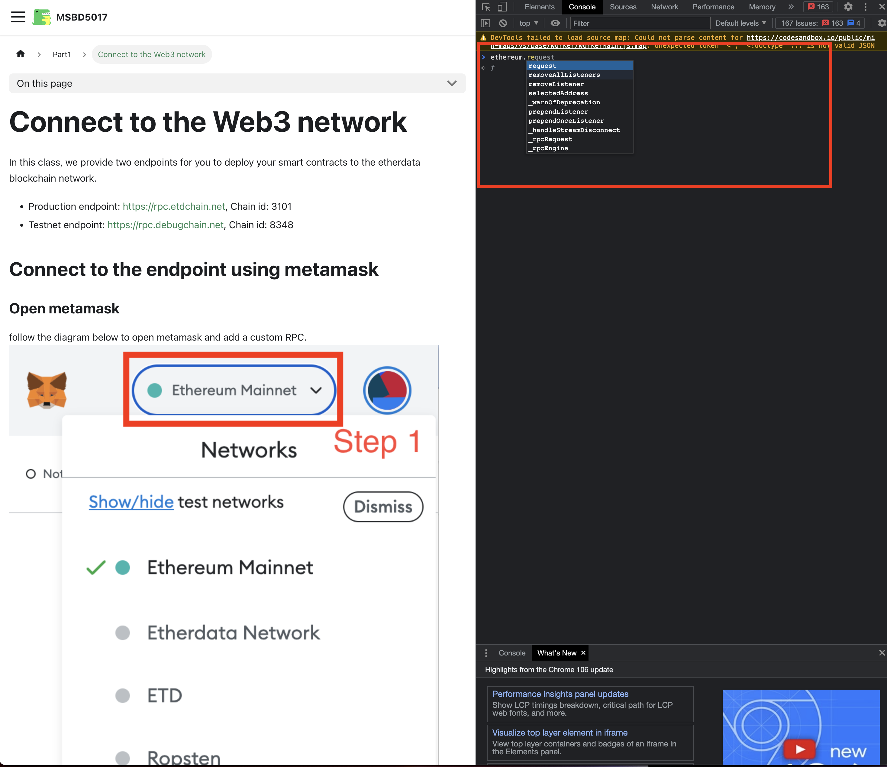

MetaMask, one of the most popular Ethereum wallets, 
is a browser extension that allows you to interact with the Ethereum blockchain. 
It allows you to connect to the Ethereum network, manage your accounts, and sign transactions.
Almost all dApps require you to connect to MetaMask to use them. So if you want to build your own dApp,
you'll need to understand how to connect to MetaMask.

After the user installs MetaMask, the extension injects a global object called `window.ethereum` into the page.
So you can open your browser's console and type `ethereum` to see what it looks like.



The `ethereum` object has a few properties and methods that you can use to interact with MetaMask.


## Connect to the metamask demo

:::caution
Following section is an advanced topic, you can skip it if you are not familiar with the concept of `React`.
We will talk more about `React` in the future.
:::

After clicking the "Connect" button, a MetaMask popup will appear.

```jsx live
function MetaMask(props) {
  const [accounts, setAccounts] = useState([]);

  async function connect() {
    const accounts = await ethereum.request({ method: 'eth_requestAccounts' });
    setAccounts([...accounts]);
  }

  return (
    <div>
        <div>
            <div>
                <p>Accounts: {accounts.join(', ')}</p>
            </div>
        </div>
      <button onClick={connect}>Connect to MetaMask</button>
    </div>
  );
}
```

You can also use metamask to request the current balance of your account.

:::caution
The returned balance is in wei in hex, which is the smallest unit of ether.
:::

```jsx live
function MetaMask(props) {
  const [account, setAccount] = useState();
  const [balance, setBalance] = useState();

  async function connect() {
    const accounts = await ethereum.request({ method: 'eth_requestAccounts' });
    const firstAccount = accounts[0];
    // get balance
    const balance = await ethereum.request({
      method: 'eth_getBalance',
      params: [firstAccount, 'latest'],
    });
    setAccount(firstAccount);
    setBalance(balance);
  }

  return (
    <div>
        <div>
            <div>
                <p>Account: {account}</p>
                <p>Balance: {balance}</p>
            </div>
        </div>
      <button onClick={connect}>Connect to MetaMask</button>
    </div>
  );
}
```