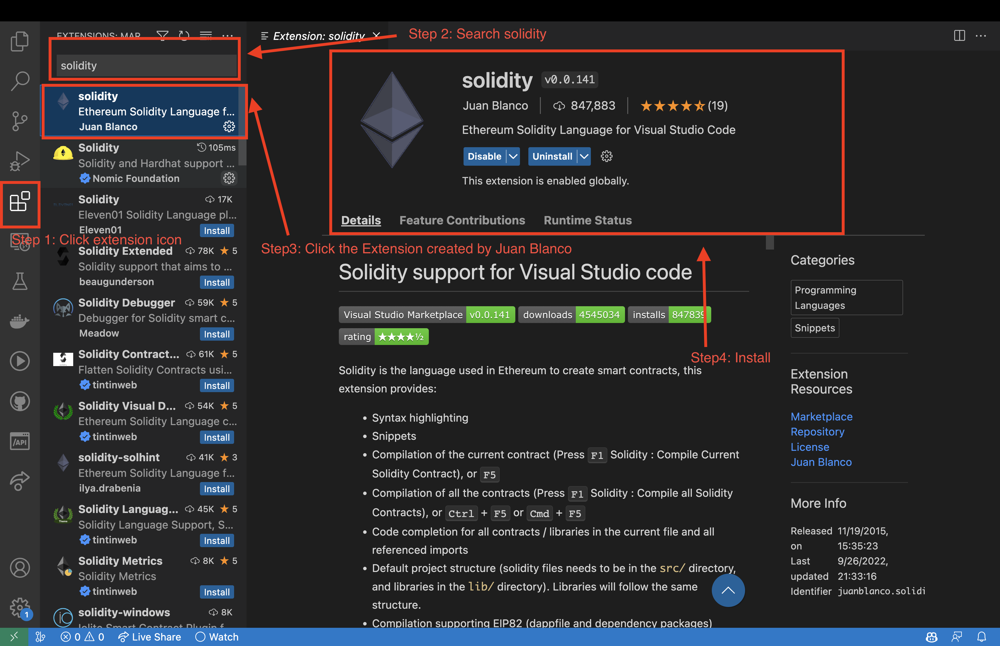
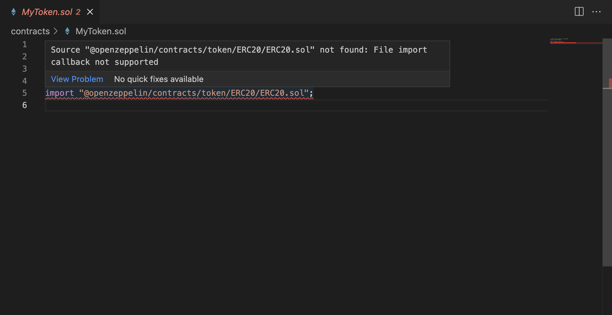
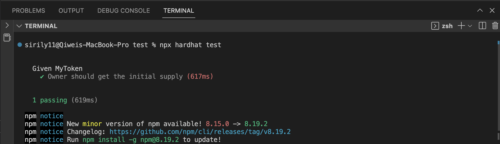
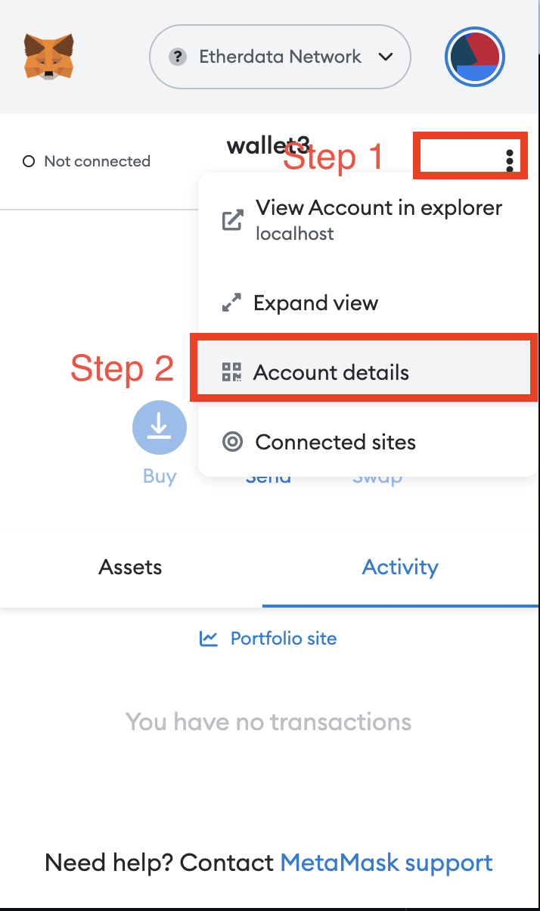
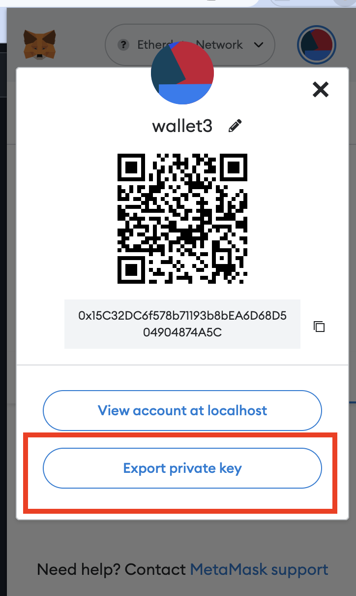
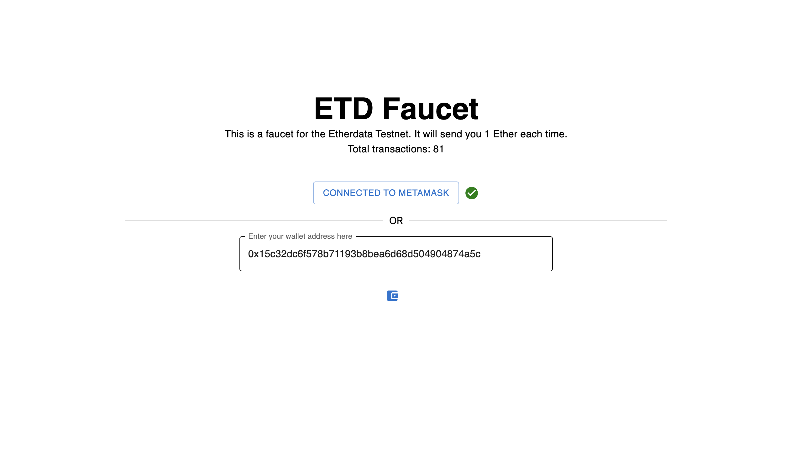
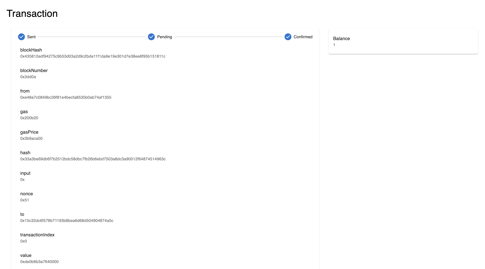

import DeployContract from "../../src/components/Chapter3/DeployContract";

# Creating a ERC20 token

## Introduction

In this tutorial, we will be creating a ERC20 token using the OpenZeppelin framework and HardHat.
You should follow [Chapter 2](/Chapter1/setup) to setup your environment.

## What is ERC20?

ERC20 is a standard for tokens on the Ethereum blockchain.
It defines a set of rules that all tokens must follow so that they are compatible with each other.
For example, if you create a token that follows the ERC20 standard,
you can interact with any other ERC20 token using the same functions and methods.

## Creating a new file

Open the `contracts` folder and create a new file called `MyToken.sol`.
This is where we will write our smart contract.

### Install VSCode extension for Solidity (optional)

If you are using VSCode, you can install the Solidity extension to get syntax highlighting and other features.



## Writing the smart contract

### Defining the dependencies

Open the `MyToken.sol` file and paste the following code which will define the version of Solidity that we are using.

```solidity
// SPDX-License-Identifier: UNLICENSED
pragma solidity ^0.8.9;
```

Then we will import the `openzeppelin-solidity/contracts/token/ERC20/ERC20.sol`
file using the `import` keyword which similar to `import` in TypeScript and Python.

```solidity
import "hardhat/console.sol";
import "@openzeppelin/contracts/token/ERC20/ERC20.sol";
```

Keep in mind that since we installed the [OpenZeppelin framework using NPM](/Chapter3/setup#install-openzeppelin)
our solidity compiler will find the `@openzeppelin/contracts/token/ERC20/ERC20.sol` package in the `node_modules` folder.
If you did not install the `openzeppelin` package, your solidity compiler will raise an error.

:::danger
Keep in mind that since we installed the [OpenZeppelin framework using NPM](/Chapter3/setup#install-openzeppelin)
our solidity compiler will find the `@openzeppelin/contracts/token/ERC20/ERC20.sol` package in the `node_modules` folder.
If you did not install the `openzeppelin` package, your solidity compiler will raise an error.


:::

### Defining the contract

Now we will define our contract. In this example, we will define a token called `MSBD5017` token
with symbol name `M57` and a total supply of 1000 tokens.

```solidity
contract MSBD5017Token is ERC20 {
    constructor() ERC20("MSBD5017", "M57") {
        _mint(msg.sender, 1000);
    }
}
```

The first line of code tells the compiler that our contract is inheriting from the `ERC20` contract from `openzeppelin` package.

```solidity
contract MSBD5017Token is ERC20 {
```

The next line of code is the constructor of our contract and called super constructor of the `ERC20` contract.
The super constructor takes two parameters, the name of the token and the symbol of the token in this case `MSBD5017` and `M57`.

```solidity
constructor() ERC20("MSBD5017", "M57") {
```

The last line of code is the line that actually creates the token and assigns the total supply to the address that deployed the contract.
In this case, we are assigning the total supply to the address that deployed the contract.
Keep in mind that `msg.sender` is the address of the account that deployed the contract.
And the reason why this is fixed supply token is that we do not provide any other way to mint a new token,
so only the `msg.sender` have the token.

```solidity
_mint(msg.sender, 1000);
```

That's it, we have created our first ERC20 token.

### Complete code

```solidity
// SPDX-License-Identifier: UNLICENSED
pragma solidity ^0.8.9;

import "hardhat/console.sol";
import "@openzeppelin/contracts/token/ERC20/ERC20.sol";

contract MSBD5017Token is ERC20 {
    constructor() ERC20("MSBD5017", "M57") {
        _mint(msg.sender, 1000);
    }
}
```

## Writing the test

Now we will write a test to test our smart contract.
Open the `test` folder and create a new file called `MyToken.test.ts`.

### Defining the dependencies

We will first define the dependencies that we will need for our test.

```typescript
import { expect } from "chai";
import { ethers } from "hardhat";
```

### Writing the test

Now we will write the test. We will first deploy the contract and then we will test the contract.

```typescript
describe("Given MyToken", function () {
  it("Owner should get the initial supply", async function () {
    const [owner] = await ethers.getSigners();
    const MyToken = await ethers.getContractFactory("MSBD5017Token");
    const myToken = await MyToken.deploy();
    await myToken.deployed();
    const ownerBalance = await myToken.balanceOf(owner.address);
    expect(ownerBalance).to.equal(1000);
  });
});
```

### Explanation

The first line of code is the `describe` block which is used to group the tests.
In this case, we are grouping the tests for the `MyToken` contract. We can put some useful
message in the `describe` block to describe what we are testing.

```typescript
describe("Given MyToken", function () {
```

The next line of code is the `it` block which is used to define a test.

```typescript
it("Owner should get the initial supply", async function () {
```

The next line of code is the `const [owner] = await ethers.getSigners();`
which is used to get the list of accounts that are available in the network.
Since we are running in a testing environment, we will use the default account provided by HardHat.

```typescript
const [owner] = await ethers.getSigners();
```

The next line of code is the `const MyToken = await ethers.getContractFactory("MSBD5017Token");`
which is used to get the contract factory for the `MSBD5017Token` contract.

:::danger
The contract name must match the [name of the contract](/Chapter3/token#defining-the-contract) in the `MyToken.sol` file.
:::

```typescript
const MyToken = await ethers.getContractFactory("MSBD5017Token");
```

The next line of code is the `const myToken = await MyToken.deploy();`
which is used to deploy the contract.

```typescript
const myToken = await MyToken.deploy();
```

The next line of code is the `await myToken.deployed();` which is used to wait for the contract to be deployed.

```typescript
await myToken.deployed();
```

The next line of code is the `const ownerBalance = await myToken.balanceOf(owner.address);`
which is used to get the balance of the owner.

```typescript
const ownerBalance = await myToken.balanceOf(owner.address);
```

The next line of code is the `expect(ownerBalance).to.equal(1000);` which is used to test the balance of the owner.

```typescript
expect(ownerBalance).to.equal(1000);
```

### Running the test

Now we will run the test. Open the terminal and run the following command.

```bash
npx hardhat test
```



## Deploying the contract

### Get your private key

In this section, we will use MetaMask as your primary wallet. If you do not have MetaMask installed, please install it first.

First open the MetaMask


Then click the `Export Private Key` button


Then copy the private key

### Create a `.env` file

We will first create a `.env` file in the root folder of the project
so that we can store the private key of the account that we will use to deploy the contract.

Copy the following line and paste it in the `.env` file.
Remember to replace the `YOUR_PRIVATE_KEY` with your own private key.

```
PK=YOUR_PRIVATE_KEY
```

### Install `dotenv` package

Run the following command to install the `dotenv` package.

```bash
npm install dotenv
```

### Modify the `hardhat.config.ts` file

Replace the content of the `hardhat.config.ts` file with the following code.

```typescript
import { HardhatUserConfig } from "hardhat/config";
import "@nomicfoundation/hardhat-toolbox";
import * as dotenv from "dotenv";

dotenv.config();

const config: HardhatUserConfig = {
  solidity: "0.8.17",
  networks: {
    etherdata: {
      url: "http://rpc.debugchain.net",
      accounts: process.env.PK !== undefined ? [process.env.PK] : [],
    },
  },
};

export default config;
```

:::note
`accounts: process.env.PK !== undefined ? [process.env.PK] : [],` this line of code is used to get the private key from the `.env` file.
:::

### Modify the `scripts/deploy.ts` file

Replace the content of the `scripts/deploy.ts` file with the following code.

```typescript
import { ethers } from "hardhat";

async function main() {
  const Contract = await ethers.getContractFactory("MSBD5017Token");
  const contract = await Contract.deploy();

  await contract.deployed();
  console.log("Contract deployed to:", contract.address);
}

// We recommend this pattern to be able to use async/await everywhere
// and properly handle errors.
main().catch((error) => {
  console.error(error);
  process.exitCode = 1;
});
```

:::note
As you can see, we are using almost the same code as the test to deploy the contract.
:::

### Claim your Ether from the faucet

Go to our [faucet website](https://faucet.debugchain.net/) to claim your testing Ether.




### Deploy the contract

Run the following command to deploy the contract.

```bash
npx hardhat run scripts/deploy.ts --network etherdata
```

<DeployContract />

<br />

:::success
Congratulations! You have successfully deployed your first smart contract.
You can download the source code of this tutorial from [here](https://files.etdchain.net/simple_erc20_token.zip).
:::
