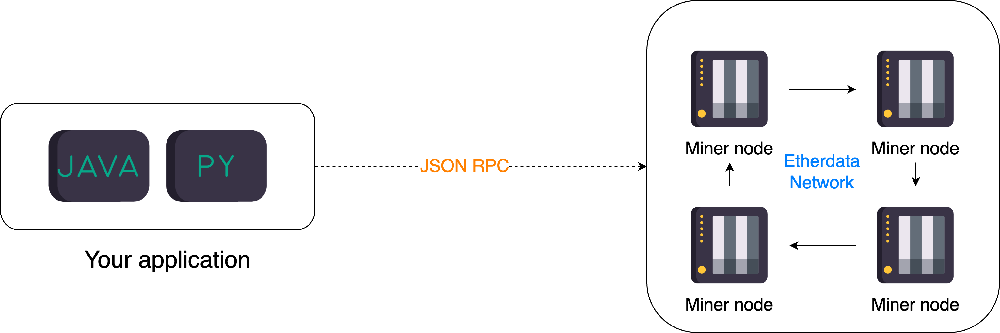

# Introduction to RPC method

[JSON RPC](https://en.wikipedia.org/wiki/JSON-RPC) or JSON Remote Procedure Call is a protocol that allows a client to
call a method on a server and get a response back. It is a stateless protocol,
which means that the server does not need to keep track of the client.

- The client can call any method on the server and the server can call any method on the client.
- The client and server can be on the same machine or on different machines.
- The client and server can be written in different programming languages.

It is widely used in dApp development. For example, the [MetaMask](https://metamask.io/)
uses JSON RPC to communicate with the Ethereum node to get the current account balance,
latest transaction information, etc.



> Diagram illustrating the JSON RPC protocol

Other SDKs like [web3.py](https://web3py.readthedocs.io/en/stable/), [web3.swift](https://github.com/argentlabs/web3.swift),
[web3j](https://docs.web3j.io/4.8.7/) and [web3.js](https://web3js.readthedocs.io/en/v1.2.11/)
also use JSON RPC to communicate with the Ethereum node. It wraps the JSON RPC calls
into a more user-friendly API in each language.

## JSON RPC request

A JSON RPC request is a JSON object with the following fields:

- `jsonrpc`: A string specifying the version of the JSON RPC protocol. The current version is "2.0".
- `method`: A string containing the name of the method to be invoked.
- `params`: An array of objects to pass as arguments to the method.
- `id`: The request id. This can be of any type. It is used to match the response with the request that it is replying to.

For example, the following is a JSON RPC request to call the `eth_getBlockByNumber` method and get the latest block:

```json
{
  "jsonrpc": "2.0",
  "method": "eth_getBlockByNumber",
  "params": ["latest", false],
  "id": "1"
}
```

The returned result is a JSON object with the following fields:

- `jsonrpc`: A string specifying the version of the JSON RPC protocol. The current version is "2.0".
- `id`: The request id. This must be the same id as the request it is replying to.
- `result`: On success, this contains the result of the method call. The result can be any JSON type, including an object, array or a primitive type. On error, this contains the error object.

The result from previous call is

```json
{
  "jsonrpc": "2.0",
  "id": "1",
  "result": {
    "difficulty": "0xa7523f",
    "extraData": "0xd883010c07846765746888676f312e31372e38856c696e7578",
    "gasLimit": "0x7a1200",
    "gasUsed": "0x0",
    "hash": "0xbb9156cc6ee2d94e9876cf8a3d0e0b9b859b41955aeb1e377003376358661751",
    "logsBloom": "0x00000000000000000000000000000000000000000000000000000000000000000000000000000000000000000000000000000000000000000000000000000000000000000000000000000000000000000000000000000000000000000000000000000000000000000000000000000000000000000000000000000000000000000000000000000000000000000000000000000000000000000000000000000000000000000000000000000000000000000000000000000000000000000000000000000000000000000000000000000000000000000000000000000000000000000000000000000000000000000000000000000000000000000000000000000000",
    "miner": "0x4274108530b88769d4738d9c12f13b04bd3eb01a",
    "mixHash": "0x0ea7c1bb8afe039f5b0e95e1d9096e6997ce4ad973f11ded4c9e66be50ee9ba3",
    "nonce": "0x6b84ffabd2fed5cb",
    "number": "0x382751",
    "parentHash": "0xeff95c83c9b869003cc035e99d79780e136014509ae92a1c47c67dc1ea5d4221",
    "receiptsRoot": "0x56e81f171bcc55a6ff8345e692c0f86e5b48e01b996cadc001622fb5e363b421",
    "sha3Uncles": "0x1dcc4de8dec75d7aab85b567b6ccd41ad312451b948a7413f0a142fd40d49347",
    "size": "0x21b",
    "stateRoot": "0x6ea32d045bc41b7e9421e1ba3cc4a19c7a7d3a3c956cea77679f815385aa9a34",
    "timestamp": "0x635752d4",
    "totalDifficulty": "0x158d3119e4e3c4",
    "transactions": [],
    "transactionsRoot": "0x56e81f171bcc55a6ff8345e692c0f86e5b48e01b996cadc001622fb5e363b421",
    "uncles": []
  }
}
```

## JSON RPC example using JavaScript

Assume that we have a function defined below:

```javascript
function add(a: number, b: number): number {
  return a + b;
}
```

Then we export this function using json rpc so that other programs can call it using the following data structure.

```javascript
{
    "jsonrpc": "2.0",
    "method": "add",
    "params": [1, 2],
    "id": "1"
}
```

:::note
As you see the name of the function is `add` which is the same as the method name in the JSON RPC request.
:::

And the result is

```json
{
  "jsonrpc": "2.0",
  "id": "1",
  "result": 3
}
```

Then we can use the JSON RPC request to call the `add` function from another programming language like python.
:::note
Suppose that the JSON RPC server is running on `localhost:3000`.
:::

```python
import requests
import json

url = "http://localhost:3000"
headers = {'content-type': 'application/json'}
payload = {
    "jsonrpc": "2.0",
    "method": "add",
    "params": [1, 2],
    "id": "1"
}
response = requests.post(url, data=json.dumps(payload), headers=headers).json()
print(response) # {'jsonrpc': '2.0', 'id': '1', 'result': 3}
```
