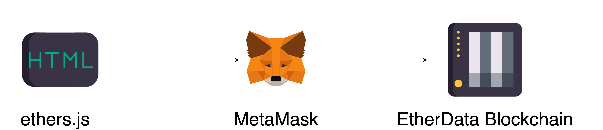

In this chapter, we will learn how to send a transaction using ethers.js.
Sending a transaction is the most common way to interact with the blockchain.
It is used to transfer funds, deploy smart contracts, and call smart contract functions.

:::note
MetaMask is act as a signer, it will sign the transaction and send it to the network.
:::
