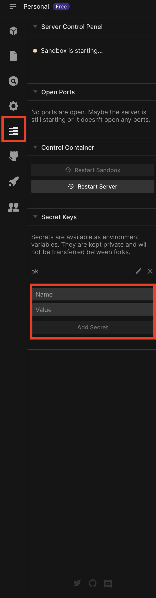

# Preparing a transaction using ethers.js

In this tutorial, we will learn how to prepare a transaction using `ethers.js`.
we will use [Testnet](/Chapter1/rpc#network-details) to send the transaction and you
can get fund from [ETDFaucet](https://faucet.debugchain.net/).

## Importing the library

First, we need to import the `ethers` library.

```typescript
import { ethers } from "ethers";
```

## Creating a provider

We need to create a provider to connect to the network. We will use the

```typescript
const provider = new ethers.providers.JsonRpcProvider(
  "https://rpc.debugchain.net"
);
```

## Creating a signer

We need to create a signer to sign the transaction.
Replace `YOUR_PRIVATE_KEY` with your private key.

```typescript
// we will get wallet from private key
const wallet = new ethers.Wallet("YOUR_PRIVATE_KEY", provider);
```

## Prepare a transaction

We can prepare a transaction by using the `signer.signTransaction` method.
Replace `RECEIVER_ADDRESS` with your address.

```typescript {12}
const receiver = "RECEIVER_ADDRESS";

// get total transaction count from sender as nonce
const nonce = await provider.getTransactionCount(wallet.address);

const signedTransaction = await signer.signTransaction({
  to: receiver,
  value: ethers.utils.parseEther("0.01"),
  nonce: nonce,
  gasPrice: await provider.getGasPrice(),
  gasLimit: 21000,
  chainId: 8348, // this is the chainId of Testnet
});
```

## Send the transaction

We can send the transaction by using the `provider.sendTransaction` method.

```typescript
const tx = await provider.sendTransaction(signedTransaction);
```

## Check the transaction

You can check the transaction status by going to `https://faucet.debugchain.net/tx/TRANSACTION_HASH`.
Replace your `TRANSACTION_HASH` with the transaction hash.

## Full code

```typescript
const provider = new ethers.providers.JsonRpcProvider(
  "https://rpc.debugchain.net"
);

// we will get wallet from private key
const wallet = new ethers.Wallet("YOUR_PRIVATE_KEY", provider);

// put your receiver here
const receiver = "RECEIVER_ADDRESS";

// get total transaction count from sender as nonce
const nonce = await provider.getTransactionCount(wallet.address);

// sign transaction
const signedTransaction = await wallet.signTransaction({
  to: receiver,
  value: ethers.utils.parseEther("0.01"),
  nonce: nonce,
  gasPrice: await provider.getGasPrice(),
  gasLimit: 21000,
  chainId: 8348,
});

console.log("Signed transaction", signedTransaction);

const txId = await provider.sendTransaction(signedTransaction);
console.log("Transaction id", txId);
```

## CodeSandbox

Before using the sandbox to send the transaction, make sure you set up the secret
in sandbox by adding `PK` in the sandbox settings. Name should be `pk` and value should be your private key.



<iframe
  src="https://codesandbox.io/embed/ethers-js-send-transaction-l8ysz1?fontsize=14&hidenavigation=1&theme=dark&view=editor"
  style={{
    width: "100%",
    height: "500px",
    border: 0,
    borderRadius: "4px",
    overflow: "hidden",
  }}
  title="ethers.js send transaction"
  allow="accelerometer; ambient-light-sensor; camera; encrypted-media; geolocation; gyroscope; hid; microphone; midi; payment; usb; vr; xr-spatial-tracking"
  sandbox="allow-forms allow-modals allow-popups allow-presentation allow-same-origin allow-scripts"
></iframe>

You can check the transaction sent in the above sandbox by going to the [ETDFaucet](https://faucet.debugchain.net/tx/0x95d351aa72c9b47ecbedfd9dd6ff2402f6087a693f42b6c615f0843e2bc070e9).
