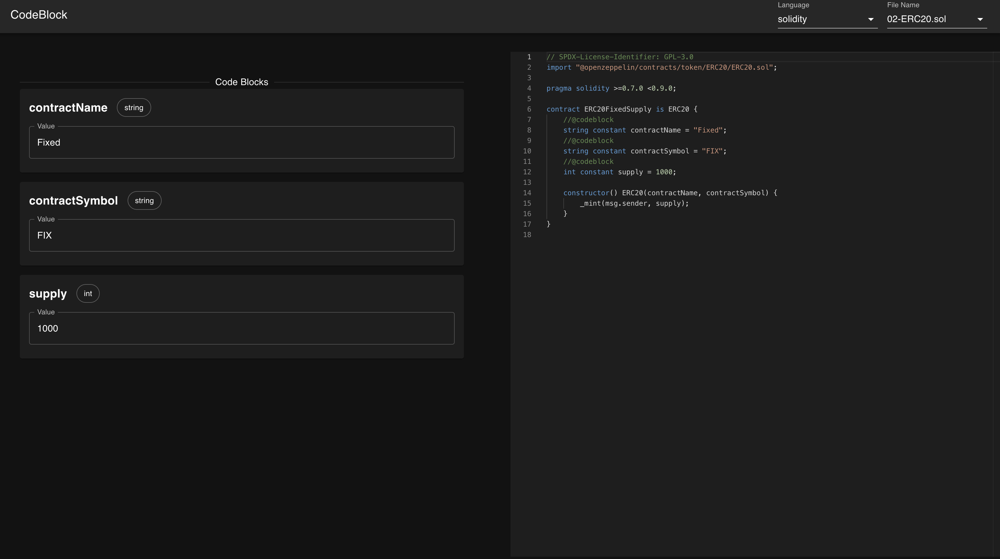

# Introduction to Solidity

In this section, we will learn about the basics of Solidity, the programming language used to write smart contracts. We will cover the following topics:

- What is Solidity?
- How to write a smart contract
- Basic data types
- Example contracts

## What is Solidity?

Solidity is a high-level programming language for writing smart contracts.
It is used to write smart contracts for the Ethereum Virtual Machine (EVM).
It is similar to JavaScript, Python, and C++.
Below is a simple example of a smart contract written in Solidity which creates a ERC20 token using 6 lines of code:

```sol
contract ERC20FixedSupply is ERC20 {
    constructor() {
        totalSupply += 1000;
        balances[msg.sender] += 1000;
    }
}
```

## CodeBlock

CodeBlock is a low code platform that user without coding experience can also modify the
parameters without knowing how to code. It also contains a lot of code examples.
Learn more at [CodeBlock](https://codeblock.vercel.app).


