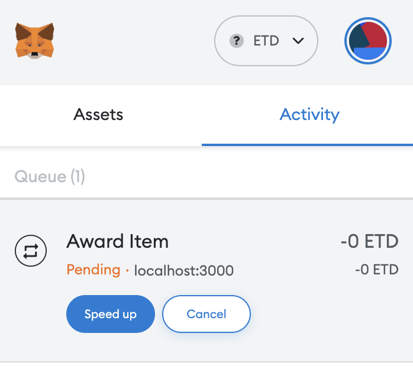

In this section, we will interact with the deployed contract using `ethers.js`.

## Code

### Import dependencies

First, we need to import the dependencies we need to interact with the contract.

```typescript
import { ethers } from "ethers";
```

### Connect to the network

```typescript
const provider = new ethers.providers.Web3Provider(window.ethereum);
await provider.send("eth_requestAccounts", []);
const signer = await provider.getSigner();
```

### Download ABI

The ABI is the interface to interact with the contract.
It is a JSON object that contains the functions and events of the contract.
We can download the ABI from [this url](https://etd-service.sgp1.cdn.digitaloceanspaces.com/MyNFT.json).

```typescript
const response = await fetch(
  "https://etd-service.sgp1.cdn.digitaloceanspaces.com/MyNFT.json"
);
const jsonData = await response.json();
const abi = jsonData.abi;
```

### Create the contract instance

```typescript
const contractAddress = "0x9ab29c1cc907448Bc081668A09Bfd77338B4D037";
const contract = new ethers.Contract(contractAddress, abi, signer);
```

### Mint a new NFT

Recall that we defined a function called `awardItem` in the contract in the [previous secion](/Chapter5/creating-an-nft#creating-the-mint-function).

```typescript
const tx = await contract.awardItem(
  signer.getAddress(),
  "https://files.etdchain.net/mynft.png"
);
await tx.wait();
```

### Check balance

```typescript
const balance = await contract.balanceOf(await signer.getAddress());
```

### See transaction in MetaMask

After calling the `awardItem` function, we can see the transaction in MetaMask.



## Interactive demo

:::warning
Transaction may take up to 1 min to be mined.
:::

```jsx live
function WalletApp(props) {
  // create states
  const [balance, setBalance] = useState(0);
  const [loading, setLoading] = useState(false);

  const onClick = useCallback(async () => {
    // get provider and signer
    const provider = new ethers.providers.Web3Provider(window.ethereum);
    setLoading(true);
    await provider.send("eth_requestAccounts", []);
    const signer = await provider.getSigner();

    // fetch abi
    const response = await fetch(
      "https://etd-service.sgp1.cdn.digitaloceanspaces.com/MyNFT.json"
    );
    const jsonData = await response.json();
    const abi = jsonData.abi;

    // create contract instance
    const contractAddress = "0x9ab29c1cc907448Bc081668A09Bfd77338B4D037";
    const contract = new ethers.Contract(contractAddress, abi, signer);

    // mint a new NFT
    const tx = await contract.awardItem(
      signer.getAddress(),
      "https://files.etdchain.net/mynft.png"
    );
    await tx.wait();

    // check balance
    const balance = await contract.balanceOf(await signer.getAddress());
    setBalance(JSON.stringify(balance));
    setLoading(false);
  }, []);

  return (
    <div>
      <div>
        <p>Balance: {loading ? "Loading..." : balance}</p>
      </div>
      <button onClick={onClick}>Sign Message</button>
    </div>
  );
}
```
