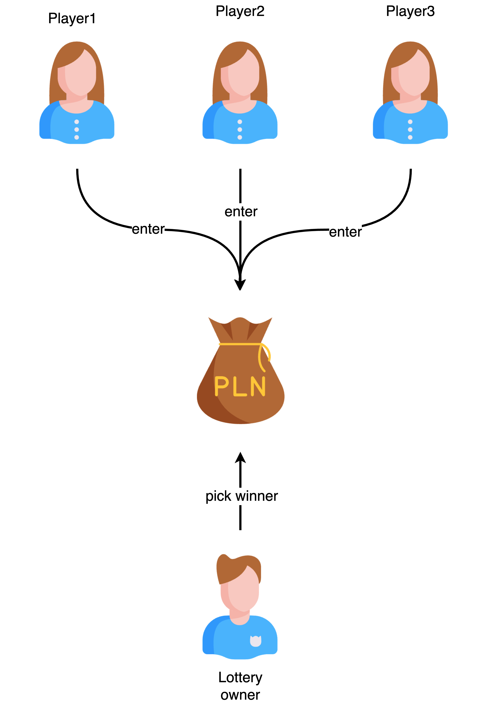

# Lottery System

## Description

User can deploy a lottery system and other participants can participate in the lottery system by sending a certain amount of tokens to the lottery system. The lottery system will randomly select a winner and send the prize to the winner.



Since blockchain is a public ledger, anyone can see the transaction history of the lottery system. Therefore, the lottery system is transparent and fair.

## Implementing the Lottery System

### Creating required fields

First, we need to create the following fields in the contract:

```solidity
address public owner;
address payable[] public players;
uint public lotteryId;
address payable[] public lotteryHistory;
```

- `owner` is the address of the contract owner. Only He/she can `pickWinner`.
- `players` is an array of addresses of the players who have participated in the lottery.
- `lotteryId` is the id of the lottery. It will be incremented by 1 after each lottery.
- `lotteryHistory` is an array of addresses of the winners of the lottery.

### Enter the lottery

The `enter` function is used to participate in the lottery. The function will be called when a user sends a certain amount of tokens to the lottery system.

```solidity
function enter() public payable {
    // require at least 0.1 ether for entering
    require(msg.value > .01 ether);
    players.push(payable(msg.sender));
}
```

### Pick a winner

The `pickWinner` function is used to pick a winner. Only the contract owner can call this function.

```solidity
function pickWinner() public onlyowner {
    uint index = getRandomNumber() % players.length;
    players[index].transfer(address(this).balance);

    lotteryHistory.push(players[index]);

    // reset the state of the contract
    players = new address payable[](0);
}
```

### Complete code

```solidity
// SPDX-License-Identifier: UNLICENSED
pragma solidity ^0.8.11;

contract Lottery {
    address public owner;
    address payable[] public players;
    address payable[] public lotteryHistory;

    constructor() {
        owner = msg.sender;
    }

    function getLotteryHistoryLength() public view returns (uint256) {
        return lotteryHistory.length - 1;
    }

    function getWinnerByLottery(uint index)
        public
        view
        returns (address payable)
    {
        return lotteryHistory[index];
    }

    function getBalance() public view returns (uint) {
        return address(this).balance;
    }

    function getPlayers() public view returns (address payable[] memory) {
        return players;
    }

    function enter() public payable {
        // require at least 0.1 ether for entering
        require(msg.value > .01 ether);
        players.push(payable(msg.sender));
    }

    function getRandomNumber() private view returns (uint) {
        return uint(keccak256(abi.encodePacked(owner, block.timestamp)));
    }

    function pickWinner() public onlyowner {
        uint index = getRandomNumber() % players.length;
        players[index].transfer(address(this).balance);

        lotteryHistory.push(players[index]);

        // reset the state of the contract
        players = new address payable[](0);
    }

    modifier onlyowner() {
        require(msg.sender == owner);
        _;
    }
}
```

## Testing the Lottery System

```typescript
import { expect } from "chai";
import { ethers } from "hardhat";

describe("Given a lottery system", function () {
  it("Should be able to enter and winner takes it all", async function () {
    const [owner, firstPlayer, secondPlayer, thirdPlayer] =
      await ethers.getSigners();
    const Lottery = await ethers.getContractFactory("Lottery");
    const lottery = await Lottery.deploy();
    await lottery.deployed();

    let user1 = lottery.connect(firstPlayer);
    await user1.enter({
      value: ethers.utils.parseEther("0.1"),
    });

    let user2 = lottery.connect(secondPlayer);
    await user2.enter({
      value: ethers.utils.parseEther("0.1"),
    });

    let user3 = lottery.connect(thirdPlayer);
    await user3.enter({
      value: ethers.utils.parseEther("0.1"),
    });

    let balance = await lottery.getBalance();
    expect(balance).to.equal(ethers.utils.parseEther("0.3"));

    const tx = await lottery.pickWinner();
    await tx.wait();

    balance = await lottery.getBalance();
    expect(balance).to.equal(ethers.utils.parseEther("0"));

    const winner = await lottery.lotteryHistory(0);
    // winner should not be empty
    expect(winner).not.to.equal("0x0000000000000000000000000000000000000000");
  });
});
```

## Improved Lottery System (v1)

Current implementation has some issues:

- Only one winner
- If some one lost, then he/she need to participate in the next lottery (extra cost).

So we shall improve the lottery system to support multiple winners first. Then we shall improve the lottery system to support multiple rounds.

### Modifying `pickWinner` function

We used a `for-loop` to pick multiple winners.

```solidity {13}
/**
 * Pick n winners from the players array
 * If reward has remainder, the last winner will get the remainder
 */
function pickWinners(uint size) public onlyowner {
    require(size <= players.length);
    require(size > 0);

    address payable[] memory winners = new address payable[](size);
    // current balance of the contract
    uint256 balance = address(this).balance;

    for (uint i = 0; i < size; i++) {
        uint index = getRandomNumber() % players.length;
        address payable winner = players[index];
        uint256 reward = balance / size;
        if (i == size - 1) {
            // last winner gets the remainder
            reward = address(this).balance;
        }
        winner.transfer(reward);
        winners[i] = winner;
        players[index] = players[players.length - 1];
        players.pop();
    }

    lotteryHistory.push(winners);
}
```

And we also need to modify the history field to store multiple winners of each round.

```solidity {2}
address payable[][] public lotteryHistory;
```

### Complete code

```solidity
// SPDX-License-Identifier: UNLICENSED
// import console.log
import "hardhat/console.sol";

pragma solidity ^0.8.11;

contract LotteryV2 {
    address public owner;
    address payable[] public players;
    address payable[][] public lotteryHistory;

    constructor() {
        owner = msg.sender;
    }

    function getLotteryHistoryLength() public view returns (uint256) {
        return lotteryHistory.length - 1;
    }

    function getWinnersByLottery(uint index)
        public
        view
        returns (address payable[] memory)
    {
        return lotteryHistory[index];
    }

    function getBalance() public view returns (uint) {
        return address(this).balance;
    }

    function getPlayers() public view returns (address payable[] memory) {
        return players;
    }

    function enter() public payable {
        // require at least 0.1 ether for entering
        require(msg.value > .01 ether);
        players.push(payable(msg.sender));
    }

    function getRandomNumber() private view returns (uint) {
        return uint(keccak256(abi.encodePacked(owner, block.timestamp)));
    }

    /**
     * Pick n winners from the players array
     * If reward has remainder, the last winner will get the remainder
     */
    function pickWinners(uint size) public onlyowner {
        require(size <= players.length);
        require(size > 0);

        address payable[] memory winners = new address payable[](size);
        // current balance of the contract
        uint256 balance = address(this).balance;

        for (uint i = 0; i < size; i++) {
            uint index = getRandomNumber() % players.length;
            address payable winner = players[index];
            uint256 reward = balance / size;
            if (i == size - 1) {
                // last winner gets the remainder
                reward = address(this).balance;
            }
            winner.transfer(reward);
            winners[i] = winner;
            players[index] = players[players.length - 1];
            players.pop();
        }

        lotteryHistory.push(winners);
    }

    modifier onlyowner() {
        require(msg.sender == owner);
        _;
    }
}
```

### Complete test

```typescript
import { expect } from "chai";
import { ethers } from "hardhat";

describe("Given a lotteryV2 system", function () {
  it("Should be able to enter and winner takes it all", async function () {
    const [owner, firstPlayer, secondPlayer, thirdPlayer] =
      await ethers.getSigners();
    const Lottery = await ethers.getContractFactory("LotteryV2");
    const lottery = await Lottery.deploy();
    await lottery.deployed();

    let user1 = lottery.connect(firstPlayer);
    await user1.enter({
      value: ethers.utils.parseEther("0.1"),
    });

    let user2 = lottery.connect(secondPlayer);
    await user2.enter({
      value: ethers.utils.parseEther("0.1"),
    });

    let user3 = lottery.connect(thirdPlayer);
    await user3.enter({
      value: ethers.utils.parseEther("0.1"),
    });

    let balance = await lottery.getBalance();
    expect(balance).to.equal(ethers.utils.parseEther("0.3"));

    const tx = await lottery.pickWinners(2);
    await tx.wait();

    balance = await lottery.getBalance();
    expect(balance).to.equal(ethers.utils.parseEther("0"));

    const winners = await lottery.getWinnersByLottery(0);
    expect(winners.length).equal(2);
  });

  it("Should be able to enter and winner takes it all", async function () {
    const [owner, firstPlayer, secondPlayer, thirdPlayer, fouthPlayer] =
      await ethers.getSigners();
    const Lottery = await ethers.getContractFactory("LotteryV2");
    const lottery = await Lottery.deploy();
    await lottery.deployed();

    let user1 = lottery.connect(firstPlayer);
    await user1.enter({
      value: ethers.utils.parseEther("0.1"),
    });

    let user2 = lottery.connect(secondPlayer);
    await user2.enter({
      value: ethers.utils.parseEther("0.1"),
    });

    let user3 = lottery.connect(thirdPlayer);
    await user3.enter({
      value: ethers.utils.parseEther("0.1"),
    });

    let user4 = lottery.connect(fouthPlayer);
    await user4.enter({
      value: ethers.utils.parseEther("0.1"),
    });

    let balance = await lottery.getBalance();
    expect(balance).to.equal(ethers.utils.parseEther("0.4"));

    const tx = await lottery.pickWinners(3);
    await tx.wait();

    balance = await lottery.getBalance();
    expect(balance).to.equal(ethers.utils.parseEther("0"));

    const winners = await lottery.getWinnersByLottery(0);
    expect(winners.length).equal(3);
  });
});
```
