# Building a simple frontend using Flutterflow

We are about to build a very simple frontend for our voting application using Flutterflow.

## Building the Wallet Setup Page

First create a new project called `VotingApp` using the blank template.

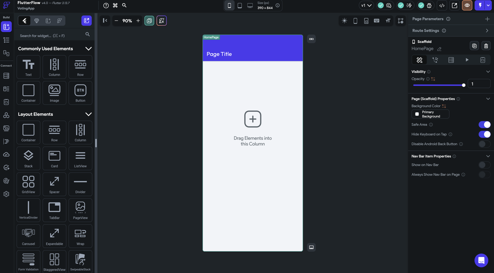

Next, we will create a `TextField` to let user enter their private key and a `RaisedButton` to let them submit the private key.

1. First drag the column widget to the screen.
   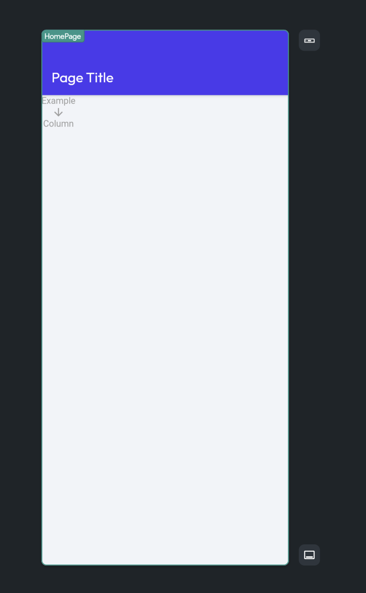
2. Click the right side `Strach` button to stretch the column to the full screen.
   :::tip
   In Flutter, column is a widget that arranges its children vertically and row is a widget that arranges its children horizontally.
   :::
   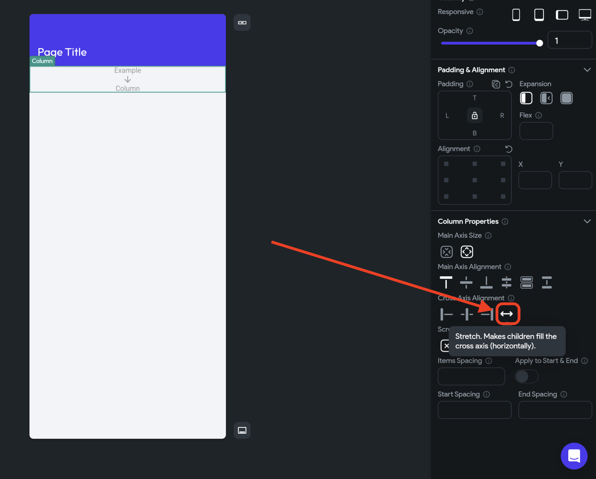
3. Drag `TextField` and `RaisedButton` to the column.
   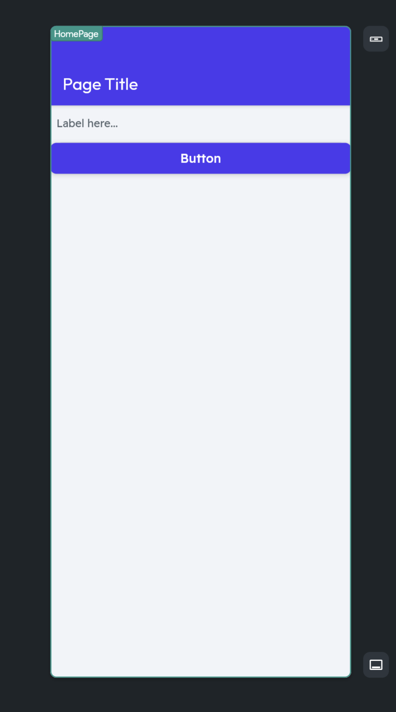
4. Beautify the `TextField` by changing the `hintText` to `Enter your private key`, `MaxLines` to 10, `RaisedButton` label to `Submit` and
   `PaddingTop` to 10.
   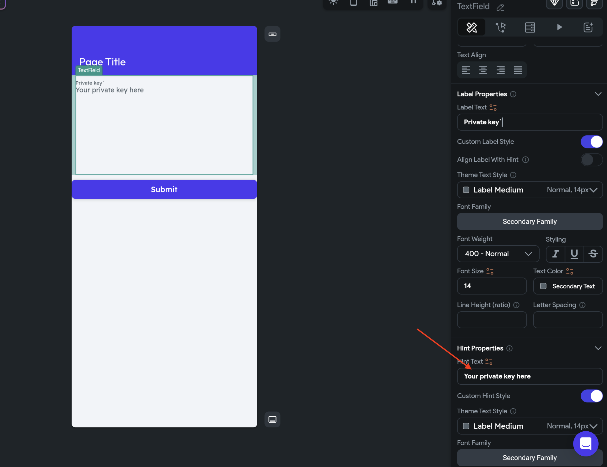
5. Click the `AppState` button on the left
   
6. Create an `AppState` variable called `privateKey` and set it to `Persisted` and then click the `Secure Persisted Fields` button to securely store the private key.
   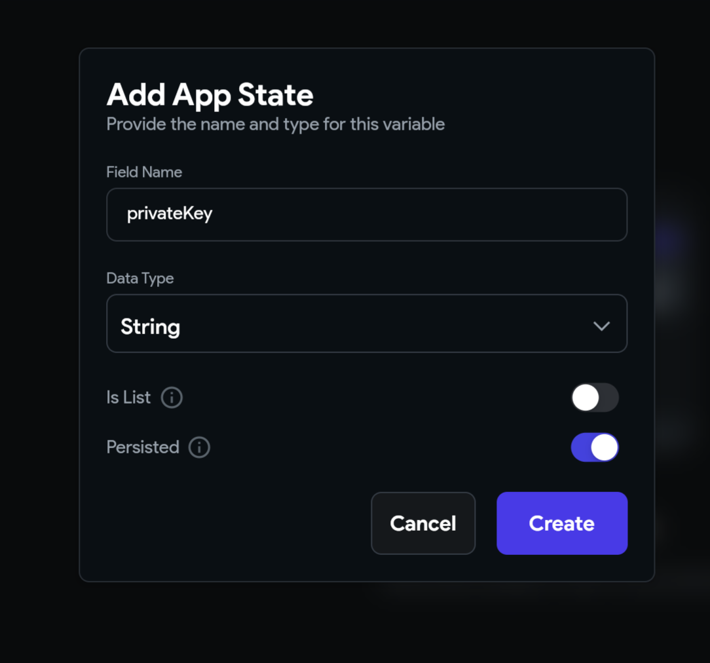
   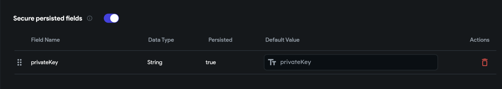
7. Click the `Submit` button, add action, click `set field value`, select `privateKey` and set it to `TextField` value.
   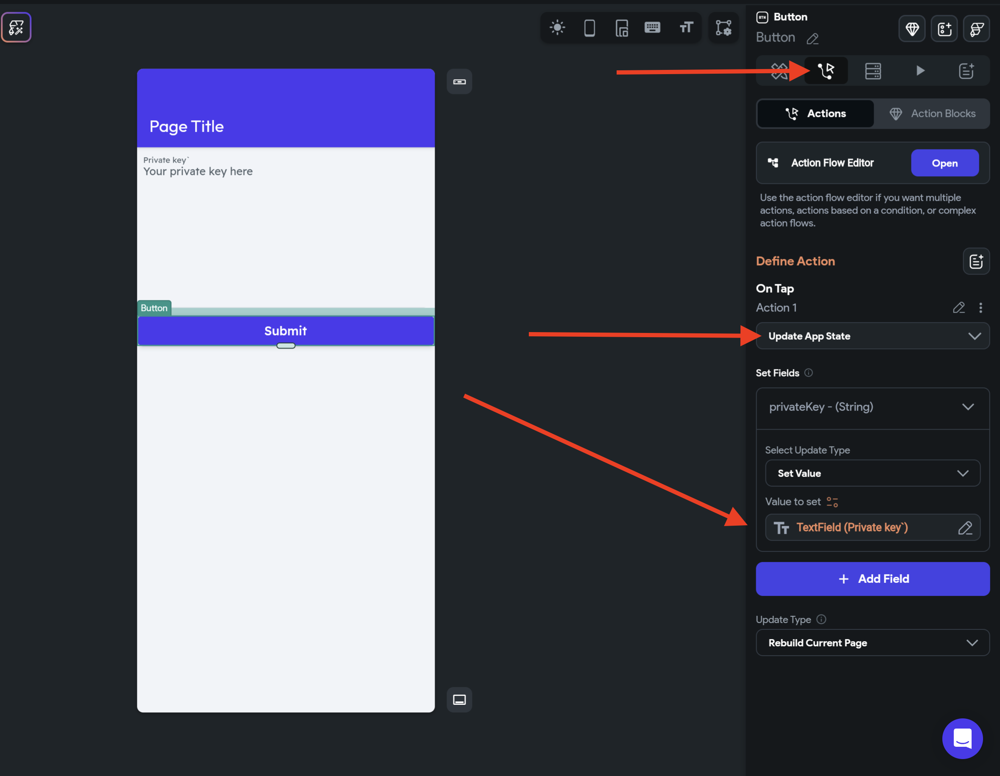
8. Rename page to `PrivateKeyPage` and set the page title to `Set up wallet`
   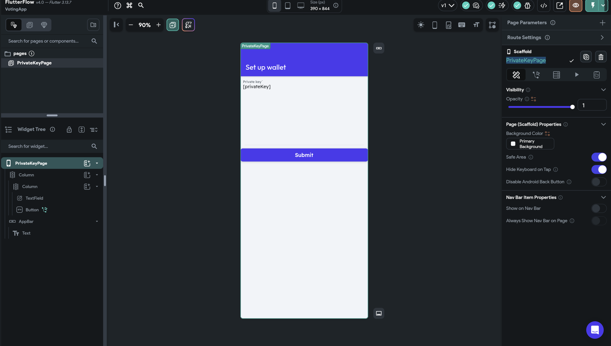
9. Create a new page called `HomePage`, click the submit button, click Open button in `Action Flow Editor` area, click add action, select `Navigate to page` and select `HomePage`.
   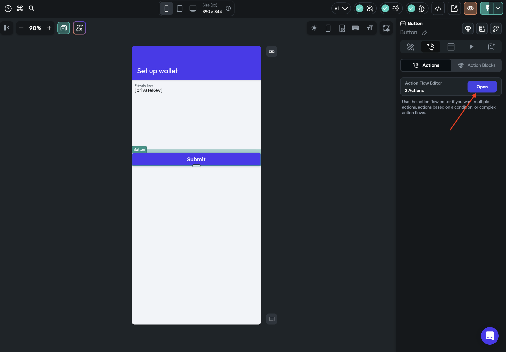
   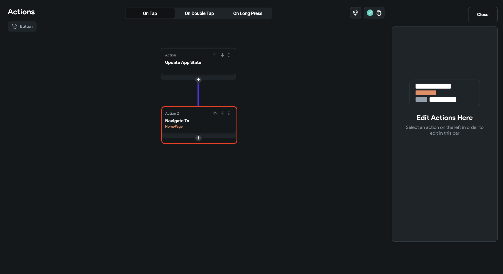

## Building the Candidate List Page

1. Drag the `ListView` into the `HomePage`
   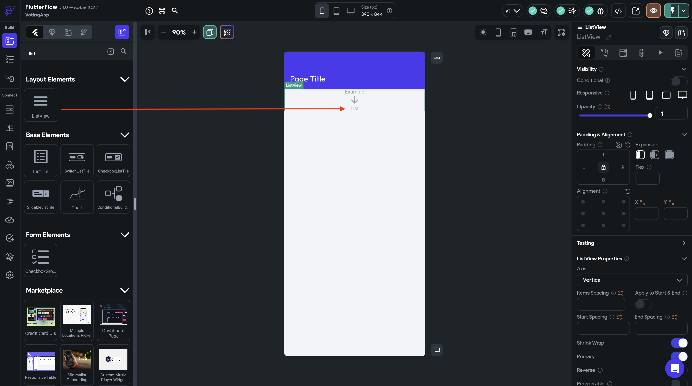
2. Drag the `ListTile` into the `ListView`
   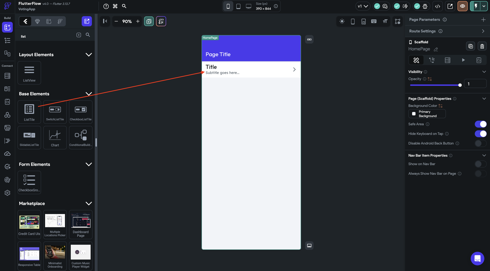
3. Change the `PageTitle` to `Candidates List`
   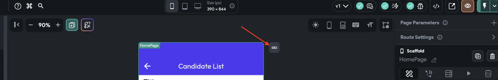
4. Change the `AppBar` style to allow user to go back to the previous page.
   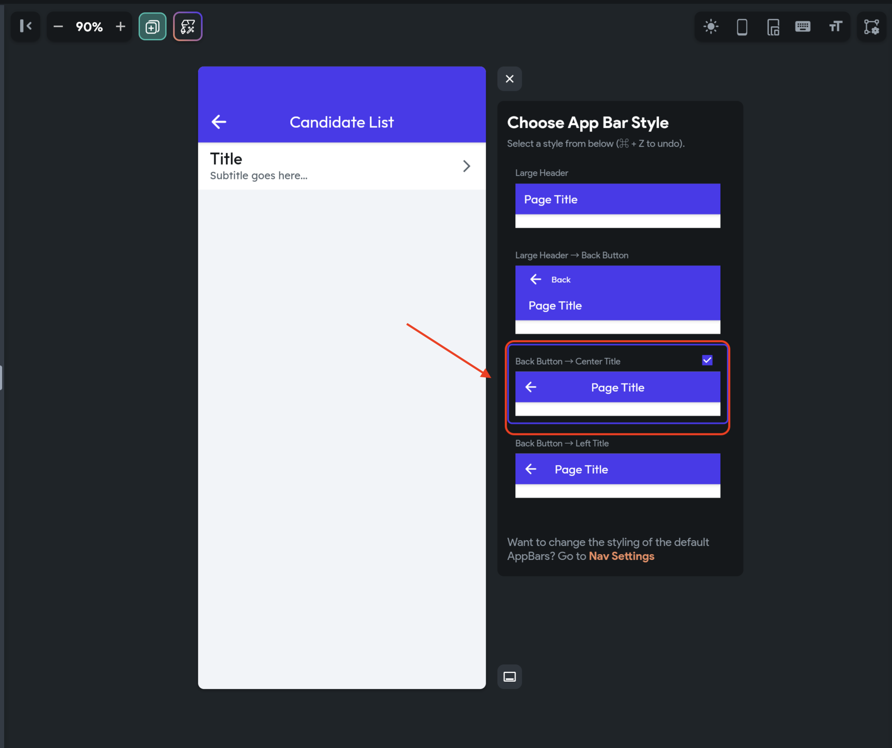
5. Click the add custom type side bar button and create a new custom type called `CandidateStruct` with two fields `name` and `address`.
   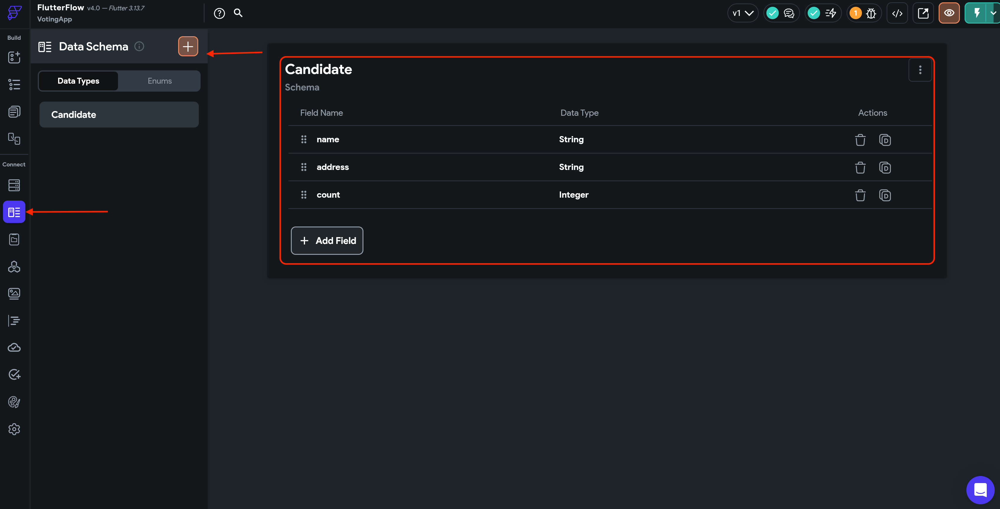
6. Add the custom function called `listCandidates`.
   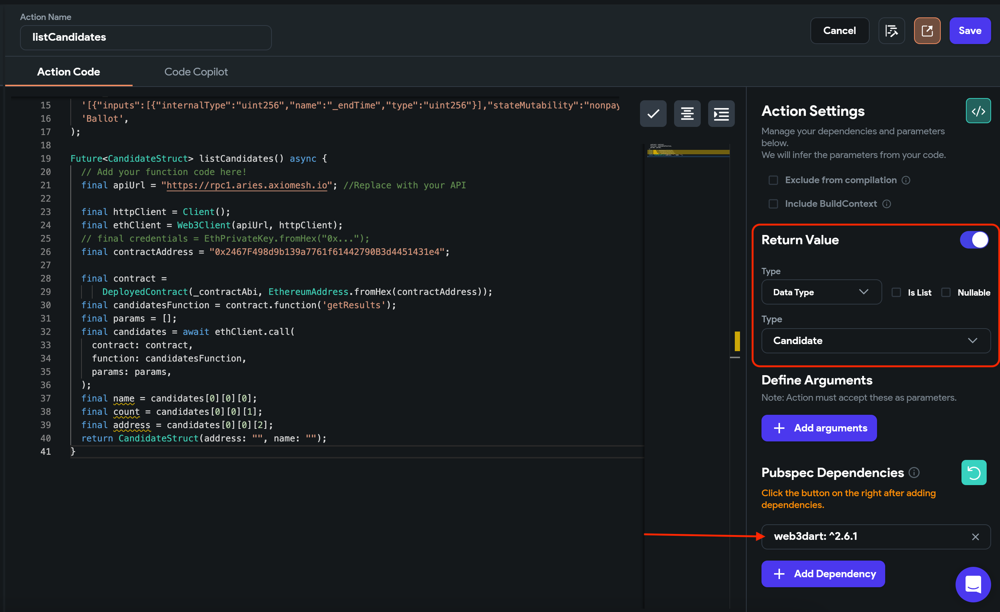
   The code in the function is as follows:

```dart
final _contractAbi = ContractAbi.fromJson(
  '[{"inputs":[{"internalType":"uint256","name":"_endTime","type":"uint256"}],"stateMutability":"nonpayable","type":"constructor"},{"anonymous":false,"inputs":[{"indexed":true,"internalType":"uint256","name":"candidateIndex","type":"uint256"}],"name":"AddCandidate","type":"event"},{"inputs":[{"internalType":"string","name":"_name","type":"string"}],"name":"registerCandidate","outputs":[],"stateMutability":"nonpayable","type":"function"},{"inputs":[{"internalType":"uint256","name":"_endTime","type":"uint256"}],"name":"reset","outputs":[],"stateMutability":"nonpayable","type":"function"},{"anonymous":false,"inputs":[],"name":"Reset","type":"event"},{"inputs":[{"internalType":"uint256","name":"candidateIndex","type":"uint256"}],"name":"vote","outputs":[],"stateMutability":"nonpayable","type":"function"},{"anonymous":false,"inputs":[{"indexed":true,"internalType":"address","name":"voter","type":"address"},{"indexed":true,"internalType":"uint256","name":"candidateIndex","type":"uint256"}],"name":"Vote","type":"event"},{"inputs":[{"internalType":"uint256","name":"","type":"uint256"}],"name":"candidates","outputs":[{"internalType":"string","name":"name","type":"string"},{"internalType":"address","name":"candidateAddress","type":"address"}],"stateMutability":"view","type":"function"},{"inputs":[],"name":"endTime","outputs":[{"internalType":"uint256","name":"","type":"uint256"}],"stateMutability":"view","type":"function"},{"inputs":[],"name":"getResults","outputs":[{"components":[{"internalType":"string","name":"name","type":"string"},{"internalType":"uint256","name":"voteCount","type":"uint256"},{"internalType":"address","name":"candidateAddress","type":"address"}],"internalType":"struct Results[]","name":"","type":"tuple[]"}],"stateMutability":"view","type":"function"},{"inputs":[],"name":"isEnded","outputs":[{"internalType":"bool","name":"","type":"bool"}],"stateMutability":"view","type":"function"},{"inputs":[],"name":"owner","outputs":[{"internalType":"address","name":"","type":"address"}],"stateMutability":"view","type":"function"},{"inputs":[],"name":"startTime","outputs":[{"internalType":"uint256","name":"","type":"uint256"}],"stateMutability":"view","type":"function"},{"inputs":[],"name":"totalVotes","outputs":[{"internalType":"uint256","name":"","type":"uint256"}],"stateMutability":"view","type":"function"},{"inputs":[{"internalType":"uint256","name":"","type":"uint256"}],"name":"voters","outputs":[{"internalType":"address","name":"","type":"address"}],"stateMutability":"view","type":"function"},{"inputs":[{"internalType":"address","name":"","type":"address"}],"name":"voterStatus","outputs":[{"internalType":"bool","name":"","type":"bool"}],"stateMutability":"view","type":"function"},{"inputs":[{"internalType":"address","name":"","type":"address"}],"name":"votesReceived","outputs":[{"internalType":"uint256","name":"","type":"uint256"}],"stateMutability":"view","type":"function"}]',
  'Ballot',
);

Future<List<CandidateStruct>> listCandidates() async {
  // Add your function code here!
  final apiUrl = "https://rpc1.aries.axiomesh.io"; //Replace with your API

  final httpClient = Client();
  final ethClient = Web3Client(apiUrl, httpClient);
  // final credentials = EthPrivateKey.fromHex("0x...");
  final contractAddress = "0x2467F498d9b139a7761f61442790B3d4451431e4";

  final contract =
      DeployedContract(_contractAbi, EthereumAddress.fromHex(contractAddress));
  final candidatesFunction = contract.function('getResults');
  final params = [];
  final candidates = await ethClient.call(
    contract: contract,
    function: candidatesFunction,
    params: params,
  );

  final candidatesResult = (candidates[0] as List).map((e) {
    final String name = e[0];
    final BigInt count = e[1];
    final EthereumAddress address = e[2];

    return CandidateStruct(
      name: name,
      address: address.hex,
      count: count.toInt(),
    );
  }).toList();

  return candidatesResult;
}
```

7. Add Custom Action to `HomePage`

   First, create a local state variable called candidates
   so that we can store the candidates list returned from the `listCandidates` function.
   Remeber to click `isList` checkbox to indicate that the variable is a list.
   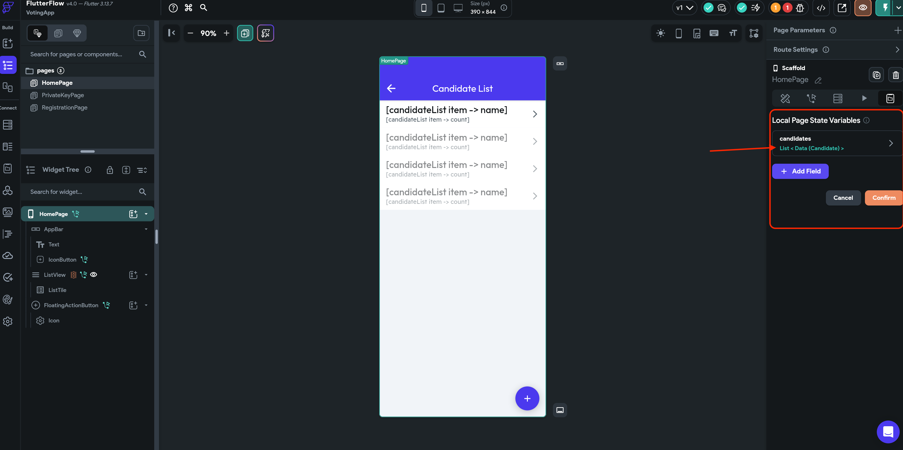

   Then, we can setup the `action` by building up the action chain.
   :::info
   We will first call the `listCandidates` function to get the candidates list
   and then set the `candidates` variable to the result.

   Finally, we will store the `candidates` variable to the `LocalState` so that we can use it afterwards.
   :::
   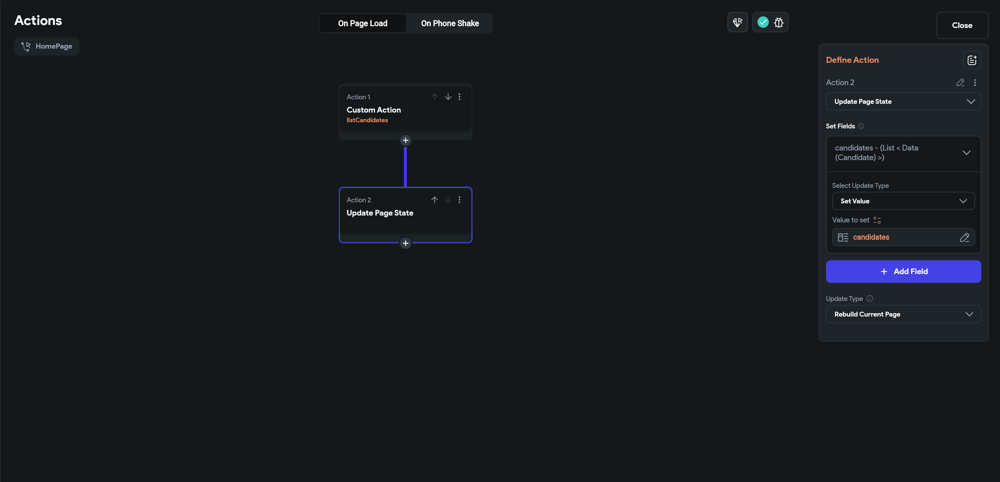

8. Setup the listview's data source
   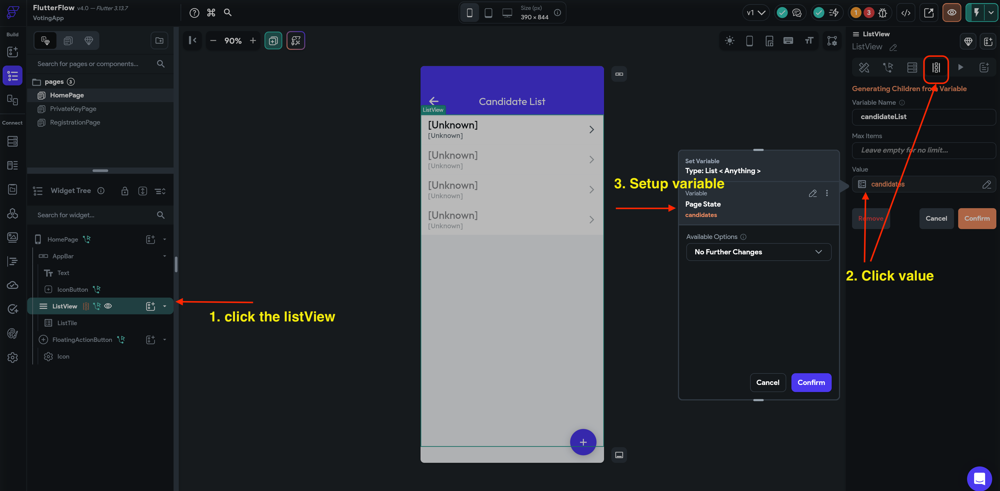
9. Setup the `listtile`'s title and subtitle by first clicking the `listtile` and then clicking the `variable` button.
   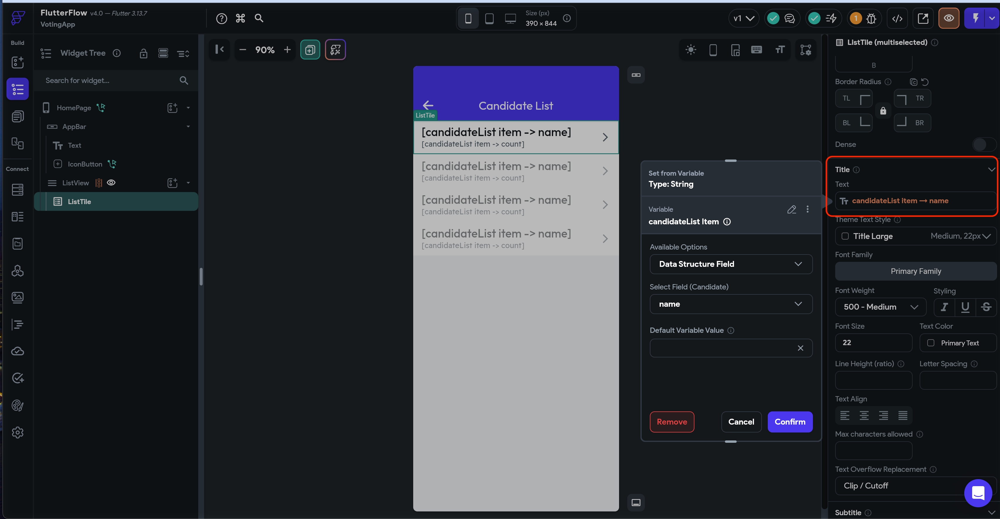
   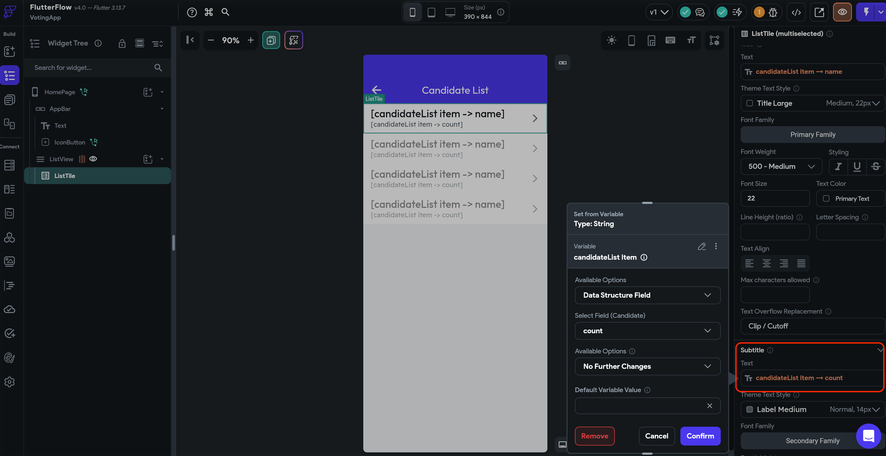

## Add `RegisterCandidate` functionality

1. Drag `Fab` to `HomePage`
   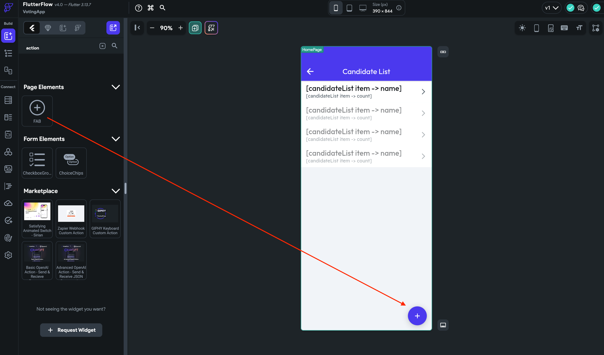
2. Create a new page called `RegistrationPage`
3. Follow the previous steps, change the page title to `Register Candidate`,
   add a `TextField` and a `RaisedButton` to the page.
   
4. Add navigation action that allows user to navigate to `RegistrationPage` from `HomePage`
   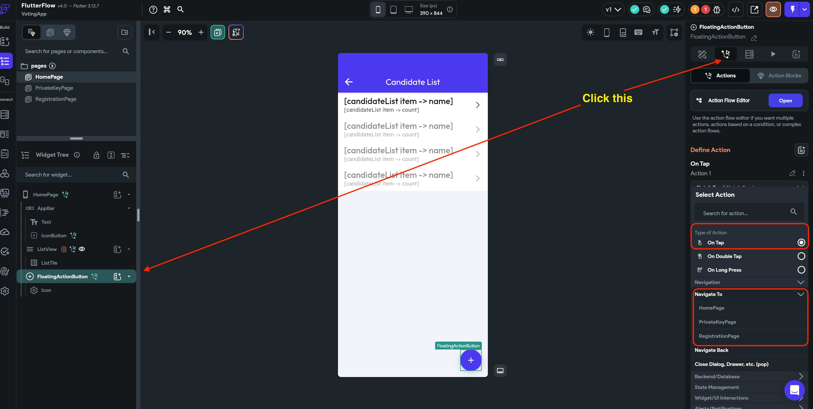
5. Create a new custom function called `registerCandidate` that takes in a `String` parameter called `name`.
   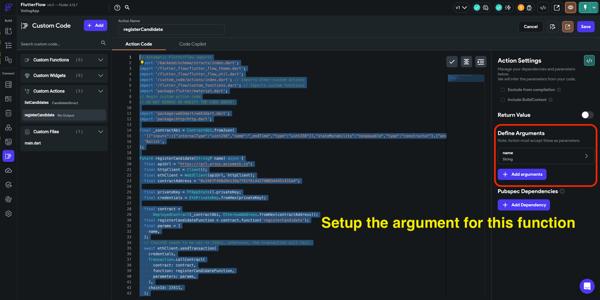
   The code in the function is as follows:

```dart
// Automatic FlutterFlow imports
import '/backend/schema/structs/index.dart';
import '/flutter_flow/flutter_flow_theme.dart';
import '/flutter_flow/flutter_flow_util.dart';
import '/custom_code/actions/index.dart'; // Imports other custom actions
import '/flutter_flow/custom_functions.dart'; // Imports custom functions
import 'package:flutter/material.dart';
// Begin custom action code
// DO NOT REMOVE OR MODIFY THE CODE ABOVE!

import 'package:web3dart/web3dart.dart';
import 'package:http/http.dart';

final _contractAbi = ContractAbi.fromJson(
  '[{"inputs":[{"internalType":"uint256","name":"_endTime","type":"uint256"}],"stateMutability":"nonpayable","type":"constructor"},{"anonymous":false,"inputs":[{"indexed":true,"internalType":"uint256","name":"candidateIndex","type":"uint256"}],"name":"AddCandidate","type":"event"},{"inputs":[{"internalType":"string","name":"_name","type":"string"}],"name":"registerCandidate","outputs":[],"stateMutability":"nonpayable","type":"function"},{"inputs":[{"internalType":"uint256","name":"_endTime","type":"uint256"}],"name":"reset","outputs":[],"stateMutability":"nonpayable","type":"function"},{"anonymous":false,"inputs":[],"name":"Reset","type":"event"},{"inputs":[{"internalType":"uint256","name":"candidateIndex","type":"uint256"}],"name":"vote","outputs":[],"stateMutability":"nonpayable","type":"function"},{"anonymous":false,"inputs":[{"indexed":true,"internalType":"address","name":"voter","type":"address"},{"indexed":true,"internalType":"uint256","name":"candidateIndex","type":"uint256"}],"name":"Vote","type":"event"},{"inputs":[{"internalType":"uint256","name":"","type":"uint256"}],"name":"candidates","outputs":[{"internalType":"string","name":"name","type":"string"},{"internalType":"address","name":"candidateAddress","type":"address"}],"stateMutability":"view","type":"function"},{"inputs":[],"name":"endTime","outputs":[{"internalType":"uint256","name":"","type":"uint256"}],"stateMutability":"view","type":"function"},{"inputs":[],"name":"getResults","outputs":[{"components":[{"internalType":"string","name":"name","type":"string"},{"internalType":"uint256","name":"voteCount","type":"uint256"},{"internalType":"address","name":"candidateAddress","type":"address"}],"internalType":"struct Results[]","name":"","type":"tuple[]"}],"stateMutability":"view","type":"function"},{"inputs":[],"name":"isEnded","outputs":[{"internalType":"bool","name":"","type":"bool"}],"stateMutability":"view","type":"function"},{"inputs":[],"name":"owner","outputs":[{"internalType":"address","name":"","type":"address"}],"stateMutability":"view","type":"function"},{"inputs":[],"name":"startTime","outputs":[{"internalType":"uint256","name":"","type":"uint256"}],"stateMutability":"view","type":"function"},{"inputs":[],"name":"totalVotes","outputs":[{"internalType":"uint256","name":"","type":"uint256"}],"stateMutability":"view","type":"function"},{"inputs":[{"internalType":"uint256","name":"","type":"uint256"}],"name":"voters","outputs":[{"internalType":"address","name":"","type":"address"}],"stateMutability":"view","type":"function"},{"inputs":[{"internalType":"address","name":"","type":"address"}],"name":"voterStatus","outputs":[{"internalType":"bool","name":"","type":"bool"}],"stateMutability":"view","type":"function"},{"inputs":[{"internalType":"address","name":"","type":"address"}],"name":"votesReceived","outputs":[{"internalType":"uint256","name":"","type":"uint256"}],"stateMutability":"view","type":"function"}]',
  'Ballot',
);

Future registerCandidate(String? name) async {
  final apiUrl = "https://rpc1.aries.axiomesh.io";
  final httpClient = Client();
  final ethClient = Web3Client(apiUrl, httpClient);
  final contractAddress = "0x2467F498d9b139a7761f61442790B3d4451431e4";

  final privateKey = FFAppState().privateKey;
  final credentials = EthPrivateKey.fromHex(privateKey);

  final contract =
      DeployedContract(_contractAbi, EthereumAddress.fromHex(contractAddress));
  final registerCandidateFunction = contract.function('registerCandidate');
  final params = [
    name,
  ];
  // ChainID needs to be set to 23411, otherwise, the transaction will fail.
  await ethClient.sendTransaction(
    credentials,
    Transaction.callContract(
      contract: contract,
      function: registerCandidateFunction,
      parameters: params,
    ),
    chainId: 23411,
  );
}
```

6. Add action to `RaisedButton` to call the `registerCandidate` function.
   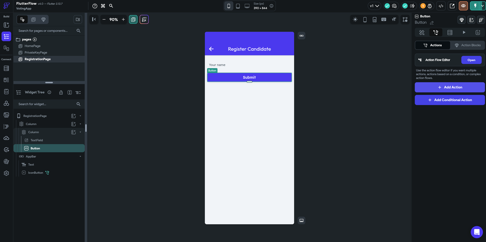
7. Config `ActionChain` to enable user to navigate back to `HomePage` after the registration is successful.
   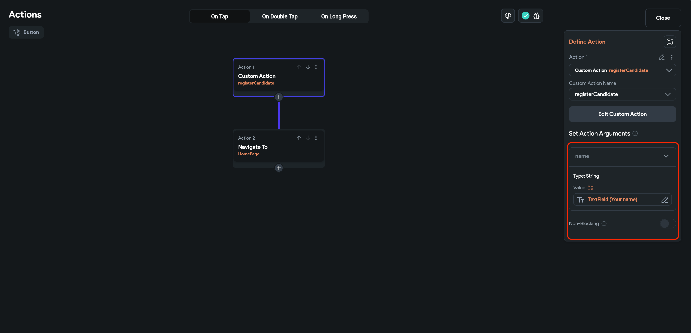
