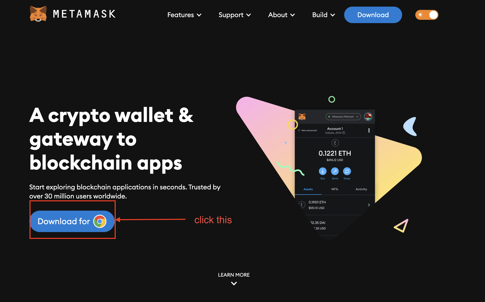
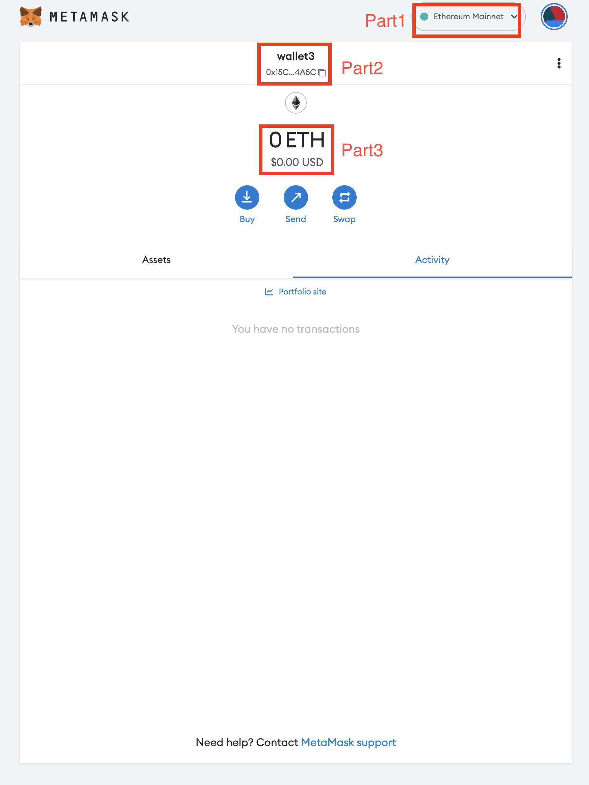
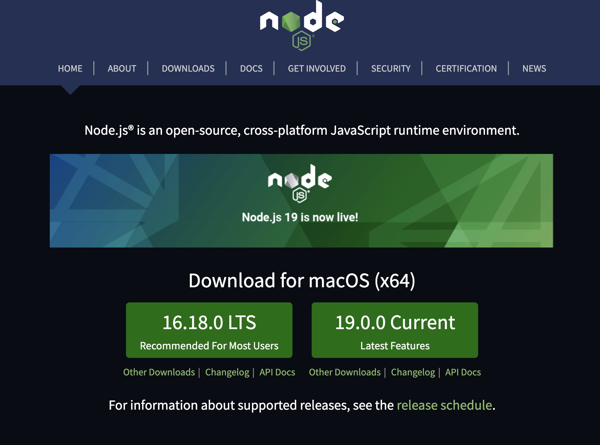
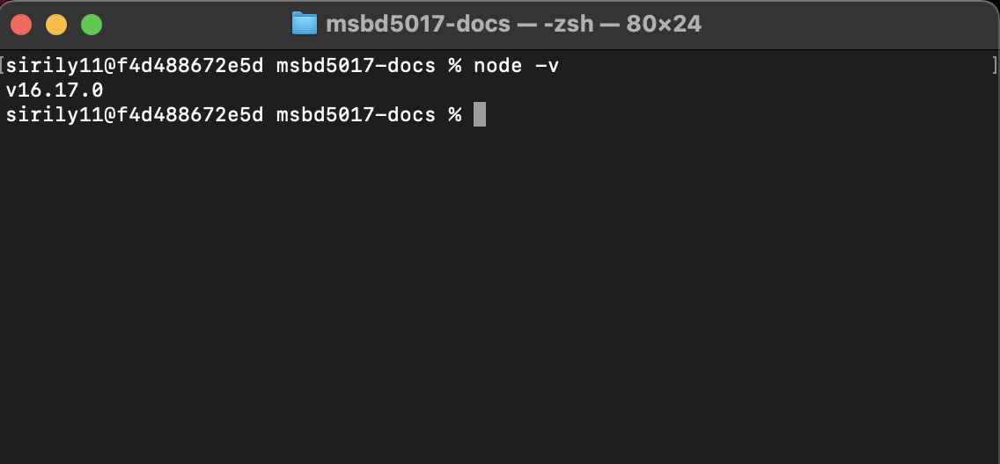
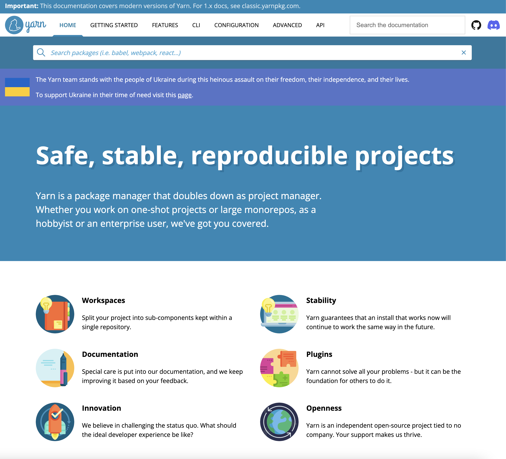
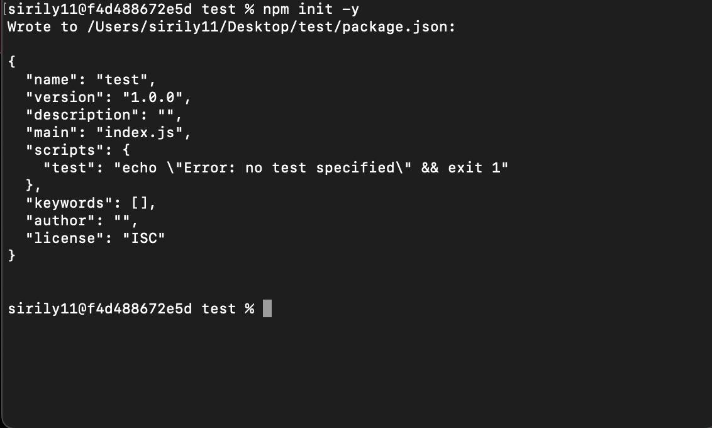
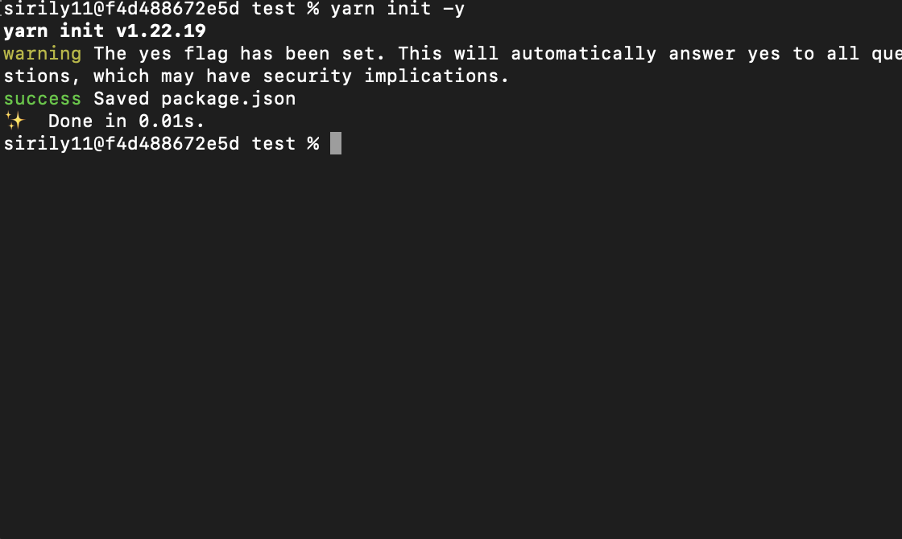
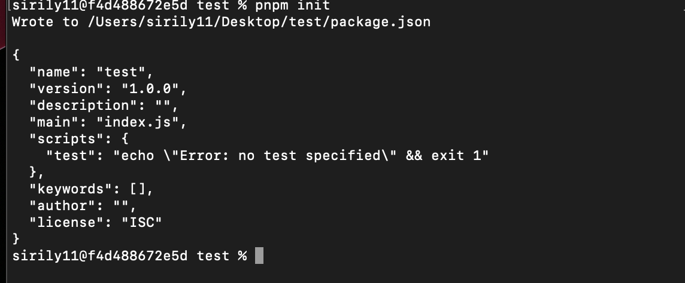

import Tabs from '@theme/Tabs';
import TabItem from '@theme/TabItem';

In order to start your web3 journey, you need to create your wallet first either using [MetaMask](https://metamask.io/) or using [ethers.js](https://docs.ethers.io/v5/). We will talk about creating wallet using MetaMask first and then we will talk about creating wallet using ethers.js.

## Creating wallet using MetaMask

### Download MetaMask from [here](https://metamask.io/)

> MetaMask is a Chrome extension so you need to have Chrome installed on your computer.



### Follow the installation instructions and create your wallet using mnemonic words.

> Keep in mind that you need to save your mnemonic words somewhere safe. If you lose your mnemonic words, you will lose your wallet and all the funds in it.

### Check your MetaMask wallet

After you create your wallet, you should see something like this:



- part1: This is your network menu. You can change it to any network you want.
- part2: This is your Wallet address and you can copy it by clicking on the copy icon.
- part3: This is your balance in Ether.

## Creating wallet using ethers.js

### Install [node.js](https://nodejs.org/en/)

> You can download any version of the node.js, however, we recommand you use the LTS version.



### Install node.js and check the installation

Follow the installation instructions and check the installation by running the following command in your terminal:

```bash
node -v
```


> Extra: By default, node.js comes with npm, a node package manager, for installing node packages. However, you can install other advanced package managers like [yarn](https://yarnpkg.com/) or [pnpm](https://pnpm.io/). We will list commands in three different package managers: npm, yarn, and pnpm. You can choose any package manager you want.


> Yarn package manager


> pnpm package manager

### Create a node package

Create a test folder

```bash
mkdir test
```

Change directory to test

```bash
cd test
```

Create a node package

<Tabs>
<TabItem value="npm" label="Npm">

```bash
npm init -y
```



</TabItem>
<TabItem value="yarn" label="Yarn">

```bash
yarn init -y
```



</TabItem>
<TabItem value="pnpm" label="Pnpm">

```bash
pnpm init
```



</TabItem>
</Tabs>

Now you have have the following folder structure:

```bash
test/
├─ package.json
```


### Install ethers.js


<Tabs>
<TabItem value="npm" label="Npm">

```bash
npm install ethers
```

</TabItem>
<TabItem value="yarn" label="Yarn">

```bash
yarn add ethers
```

</TabItem>
<TabItem value="pnpm" label="Pnpm">

```bash
pnpm install ethers
```

</TabItem>
</Tabs>

Now you have have the following folder structure:

```bash
test/
├─ node_modules/
├─ package.json
```

note that node_modules is the folder where all the packages you install are stored. 
You should add node_modules to your .gitignore file and never commit it to your repository.


